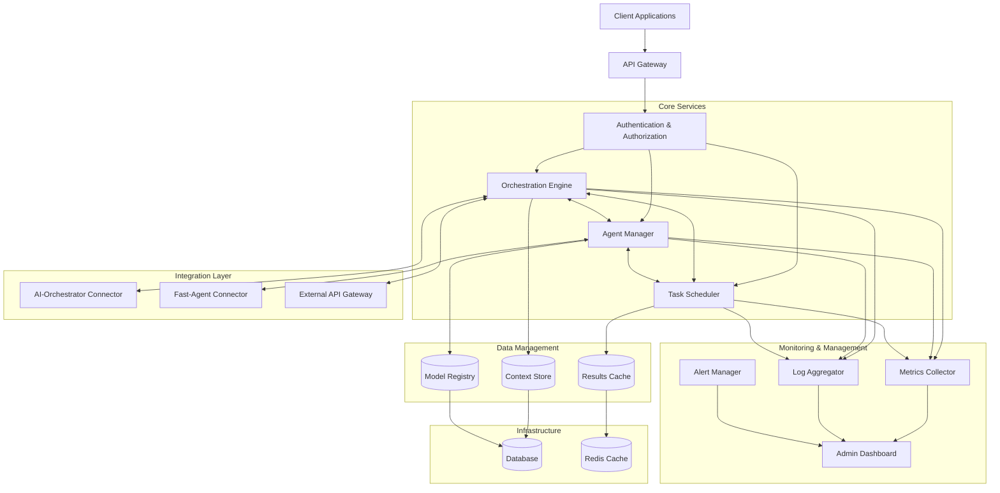

# AI-Orchestration-Platform Architecture

## Overview

The AI-Orchestration-Platform is designed as a modular, scalable system that integrates the capabilities of AI-Orchestrator and Fast-Agent frameworks. This document outlines the high-level architecture, key components, and their interactions.

## System Architecture

## Key Components

### Core Services

1. **Orchestration Engine**
   - Manages the overall workflow execution
   - Coordinates between different agents and tasks
   - Handles error recovery and retry logic
   - Provides workflow status and monitoring

2. **Agent Manager**
   - Manages the lifecycle of AI agents
   - Handles agent registration and discovery
   - Monitors agent health and performance
   - Implements load balancing and scaling strategies

3. **Task Scheduler**
   - Schedules tasks based on priority and dependencies
   - Implements queuing mechanisms
   - Handles task distribution and load balancing
   - Provides task status tracking

### Integration Layer

1. **AI-Orchestrator Connector**
   - Provides integration with AI-Orchestrator framework
   - Translates between platform-specific and common formats
   - Handles authentication and communication with AI-Orchestrator

2. **Fast-Agent Connector**
   - Provides integration with Fast-Agent framework
   - Manages Fast-Agent specific configurations
   - Handles authentication and communication with Fast-Agent

3. **External API Gateway**
   - Provides integration with external services and APIs
   - Implements rate limiting and caching
   - Handles authentication and security for external services

### Data Management

1. **Context Store**
   - Stores workflow context and state
   - Provides persistence for long-running workflows
   - Implements versioning and history tracking

2. **Model Registry**
   - Manages AI model metadata and versions
   - Tracks model performance metrics
   - Provides model discovery and selection capabilities

3. **Results Cache**
   - Caches task results for performance optimization
   - Implements time-based and size-based eviction policies
   - Provides fast access to frequently used results

## Communication Patterns

The platform uses a combination of synchronous and asynchronous communication patterns:

1. **Synchronous (REST API)**
   - Used for direct client interactions
   - Provides immediate feedback for user actions
   - Implements standard HTTP status codes and error handling

2. **Asynchronous (Message Queue)**
   - Used for long-running tasks and background processing
   - Implements publish-subscribe patterns for event distribution
   - Provides reliable message delivery with retry mechanisms

3. **WebSockets**
   - Used for real-time updates and notifications
   - Provides bidirectional communication for monitoring dashboards
   - Implements heartbeat mechanisms for connection health

## Deployment Architecture

The platform is designed to be deployed in various environments:

1. **Development**
   - Single-node Docker Compose setup
   - Local development environment with hot reloading
   - Simplified configuration for rapid iteration

2. **Testing**
   - Multi-node Docker Compose or Kubernetes setup
   - Isolated environment for integration and performance testing
   - Configurable scale for load testing

3. **Production**
   - Kubernetes-based deployment
   - High availability configuration with redundancy
   - Auto-scaling based on load metrics
   - Geographic distribution for low-latency access

## Security Architecture

The platform implements a comprehensive security model:

1. **Authentication & Authorization**
   - JWT-based authentication
   - Role-based access control
   - OAuth2 integration for third-party authentication

2. **Data Security**
   - Encryption at rest and in transit
   - Data anonymization for sensitive information
   - Secure credential management

3. **Network Security**
   - API rate limiting
   - DDoS protection
   - Web Application Firewall integration

## Future Enhancements

1. **Advanced Monitoring**
   - Distributed tracing
   - Anomaly detection
   - Predictive scaling

2. **Enhanced Integration**
   - Additional AI framework connectors
   - Standardized plugin architecture
   - Integration with CI/CD pipelines

3. **Advanced Orchestration**
   - Dynamic workflow generation
   - Self-optimizing workflows
   - Federated learning integration
