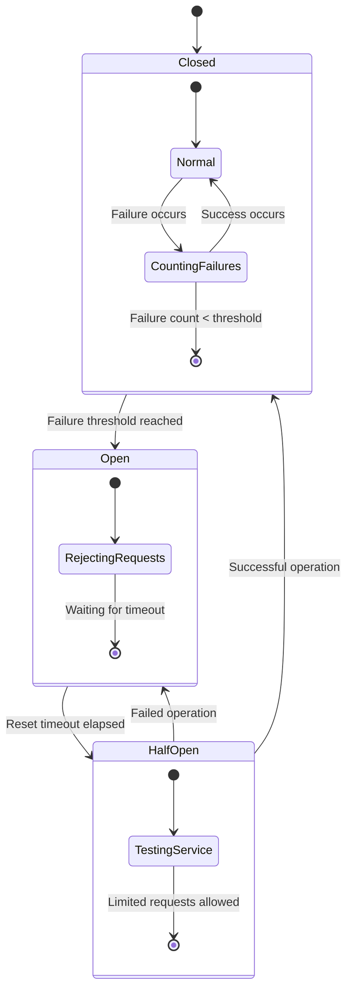

# Circuit Breaker Pattern for Dagger Operations

## Overview

The Circuit Breaker pattern is a design pattern used to detect failures and prevent cascading failures in distributed systems. It helps to maintain system stability and resilience by automatically detecting when a remote service or resource is failing and preventing the application from repeatedly trying to execute an operation that's likely to fail.

This implementation provides a Circuit Breaker specifically designed for Dagger operations, allowing you to wrap Dagger client calls with circuit breaker protection.

## How It Works

The Circuit Breaker operates in three states:

1. **Closed**: In this state, the circuit breaker allows requests to pass through normally. If a failure occurs, it increments a failure counter. When the failure counter reaches a threshold, the circuit breaker transitions to the Open state.

2. **Open**: In this state, the circuit breaker immediately rejects requests without attempting to execute them. After a specified timeout period, the circuit breaker transitions to the Half-Open state.

3. **Half-Open**: In this state, the circuit breaker allows a limited number of requests to pass through. If these requests succeed, the circuit breaker transitions back to the Closed state. If any request fails, the circuit breaker transitions back to the Open state.



## Implementation Details

The Circuit Breaker implementation consists of the following components:

- `CircuitBreaker`: The main class that implements the Circuit Breaker pattern.
- `CircuitState`: An enum representing the possible states of a circuit breaker.
- `CircuitBreakerError`: Base exception for circuit breaker errors.
- `CircuitBreakerOpenError`: Exception raised when a request is made while the circuit is open.
- `execute_with_circuit_breaker`: A utility function to execute an operation with circuit breaker protection.

## Usage

### Basic Usage

```python
from src.orchestrator.circuit_breaker import CircuitBreaker, execute_with_circuit_breaker

# Create a circuit breaker
circuit_breaker = CircuitBreaker(
    failure_threshold=5,  # Number of failures before the circuit opens
    reset_timeout=60.0,   # Time in seconds before attempting to close the circuit
    name="dagger-operations"
)

# Execute an operation with circuit breaker protection
try:
    result = await execute_with_circuit_breaker(
        circuit_breaker,
        lambda: my_dagger_operation()
    )
    print(f"Operation succeeded: {result}")
except CircuitBreakerOpenError:
    print("Circuit breaker is open, operation not attempted")
except Exception as e:
    print(f"Operation failed: {str(e)}")
```

### Using with Dagger Operations

```python
import dagger
from src.orchestrator.circuit_breaker import CircuitBreaker, execute_with_circuit_breaker

async def execute_dagger_operation(client, container_image, command, circuit_breaker=None):
    # Create a function that executes the Dagger operation
    async def dagger_operation():
        container = client.container().from_(container_image)
        result = await container.with_exec(command).stdout()
        return result
    
    # If a circuit breaker is provided, use it to wrap the operation
    if circuit_breaker:
        return await execute_with_circuit_breaker(circuit_breaker, dagger_operation)
    else:
        # Otherwise, execute the operation directly
        return await dagger_operation()

# Create a circuit breaker
circuit_breaker = CircuitBreaker(
    failure_threshold=3,
    reset_timeout=5.0,
    name="dagger-operations"
)

# Connect to Dagger
async with dagger.Connection() as client:
    # Execute a Dagger operation with circuit breaker protection
    try:
        result = await execute_dagger_operation(
            client=client,
            container_image="alpine:latest",
            command=["echo", "Hello, World!"],
            circuit_breaker=circuit_breaker
        )
        print(f"Result: {result}")
    except Exception as e:
        print(f"Error: {str(e)}")
```

### Circuit Breaker Registry

The implementation includes a registry to store circuit breakers by name, allowing you to reuse the same circuit breaker across different parts of your application:

```python
from src.orchestrator.circuit_breaker import get_circuit_breaker, reset_all_circuit_breakers

# Get a circuit breaker by name (creates it if it doesn't exist)
cb1 = get_circuit_breaker("dagger-operations")
cb2 = get_circuit_breaker("dagger-operations")  # Returns the same instance as cb1

# Reset all circuit breakers
reset_all_circuit_breakers()

# Get all circuit breakers
all_cbs = get_all_circuit_breakers()
```

## Configuration Options

The `CircuitBreaker` class accepts the following parameters:

- `failure_threshold` (default: 5): Number of failures before the circuit opens.
- `reset_timeout` (default: 60.0): Time in seconds before attempting to close the circuit.
- `half_open_max_calls` (default: 1): Maximum number of calls allowed in half-open state.
- `name` (default: "default"): Name of this circuit breaker (for logging).

## Metrics

The `CircuitBreaker` class tracks the following metrics:

- `success_count`: Number of successful operations.
- `failure_count`: Number of failed operations.
- `rejected_count`: Number of rejected operations (when the circuit is open).
- `state_changes`: Number of state transitions.

You can access these metrics using the `get_metrics()` method:

```python
metrics = circuit_breaker.get_metrics()
print(f"Circuit breaker state: {metrics['state']}")
print(f"Success count: {metrics['metrics']['success_count']}")
print(f"Failure count: {metrics['metrics']['failure_count']}")
print(f"Rejected count: {metrics['metrics']['rejected_count']}")
```

## Example

See the [Circuit Breaker Example](../../examples/dagger/circuit_breaker_example.py) for a complete example of how to use the Circuit Breaker pattern with Dagger operations.

You can run the example using the provided script:

```bash
./scripts/dagger/run_circuit_breaker_example.sh
```

## Best Practices

1. **Choose appropriate thresholds**: Set the failure threshold and reset timeout based on your specific requirements. A lower threshold will make the circuit breaker more sensitive to failures, while a higher threshold will make it more tolerant.

2. **Use different circuit breakers for different services**: Create separate circuit breakers for different services or operations to prevent failures in one service from affecting others.

3. **Monitor circuit breaker metrics**: Regularly monitor the metrics provided by the circuit breaker to identify potential issues and adjust the configuration as needed.

4. **Implement fallback mechanisms**: When the circuit breaker is open, provide fallback mechanisms to maintain service availability, such as returning cached data or default values.

5. **Log circuit breaker events**: Log state transitions and other important events to help diagnose issues.

## Integration with Error Handling

The Circuit Breaker pattern works well with the existing error handling system. When an operation fails, the circuit breaker records the failure and may open the circuit, while the error handling system can provide retry mechanisms, logging, and other error handling functionality.

```python
from src.orchestrator.circuit_breaker import CircuitBreaker, execute_with_circuit_breaker
from src.orchestrator.error_handling import retry_with_backoff

# Create a circuit breaker
circuit_breaker = CircuitBreaker(
    failure_threshold=3,
    reset_timeout=5.0,
    name="dagger-operations"
)

# Execute an operation with circuit breaker protection and retry
try:
    result = await retry_with_backoff(
        lambda: execute_with_circuit_breaker(
            circuit_breaker,
            lambda: my_dagger_operation()
        ),
        max_retries=3,
        initial_delay=1.0,
        backoff_factor=2.0
    )
    print(f"Operation succeeded: {result}")
except Exception as e:
    print(f"Operation failed after retries: {str(e)}")
```

## Conclusion

The Circuit Breaker pattern is a powerful tool for building resilient systems. By using the Circuit Breaker pattern with Dagger operations, you can prevent cascading failures and improve the overall stability of your system.
