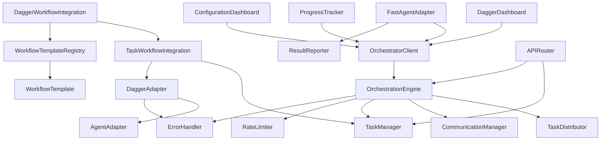
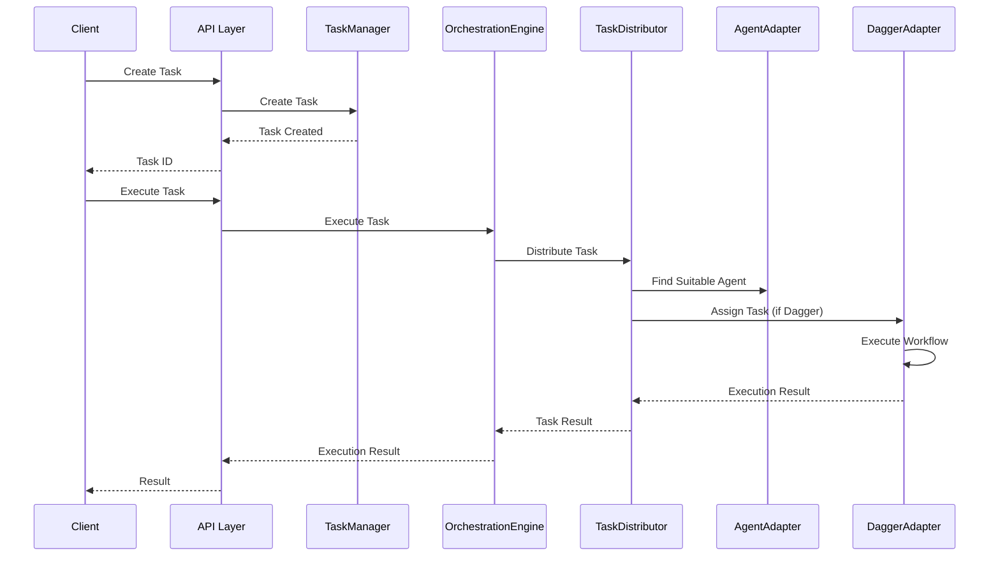
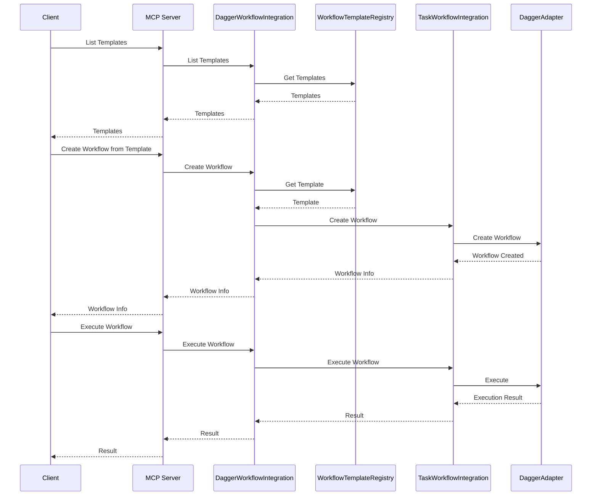
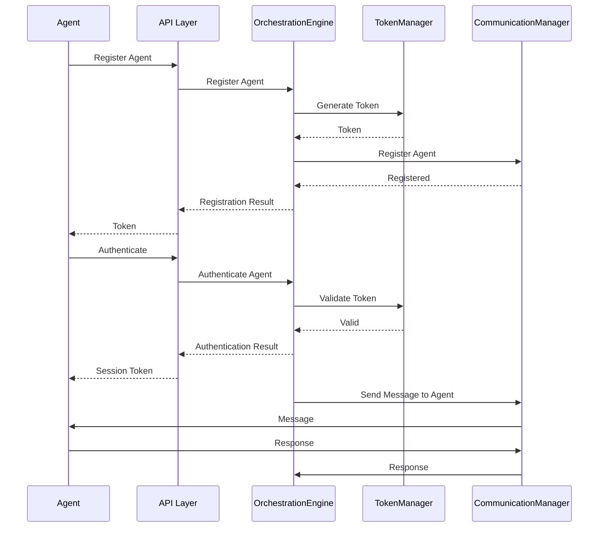
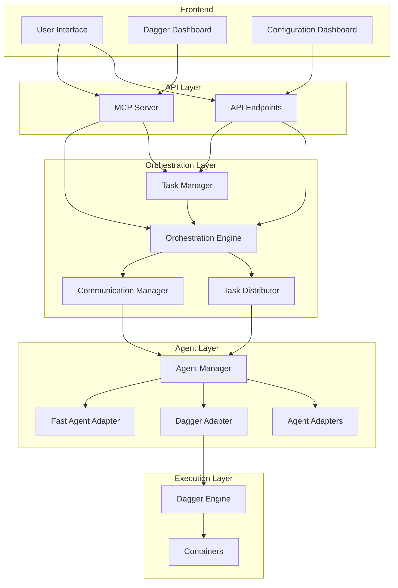
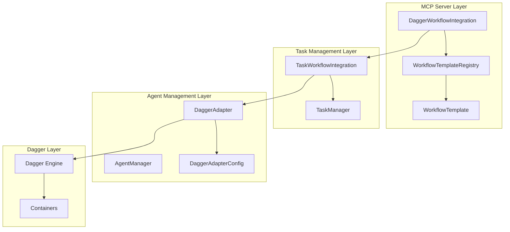
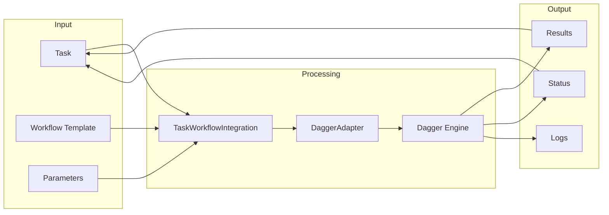

# Current Architecture Analysis for Dagger Upgrade

## 1. Overview

This document provides a comprehensive analysis of the current orchestration components in the AI-Orchestration-Platform, focusing on their responsibilities, dependencies, and data flows. This analysis establishes a baseline understanding before migrating to Dagger as the core technology.

## 2. Component Inventory

### 2.1 Core Orchestration Components

| Component | Location | Description |
|-----------|----------|-------------|
| OrchestrationEngine | src/orchestrator/engine.py | Main orchestration engine for managing workflows and their execution |
| Task | src/orchestrator/engine.py | Represents a single task in a workflow |
| Workflow | src/orchestrator/engine.py | Represents a workflow composed of multiple tasks |
| TaskDistributor | src/orchestrator/task_distribution.py | Distributes tasks to appropriate agents |
| CommunicationManager | src/orchestrator/communication.py | Manages communication between components |
| TokenManager | src/orchestrator/auth.py | Handles authentication and authorization |
| RateLimiter | src/orchestrator/rate_limiting.py | Manages rate limiting for API calls |
| ErrorHandler | src/orchestrator/error_handling.py | Handles errors and retries |

### 2.2 Agent Management Components

| Component | Location | Description |
|-----------|----------|-------------|
| AgentAdapter | src/agent_manager/adapter.py | Base class for agent adapters |
| DaggerAdapter | src/agent_manager/dagger_adapter.py | Adapter for Dagger.io containerized workflow engine |
| AgentAdapterConfig | src/agent_manager/adapter.py | Configuration for agent adapters |
| DaggerAdapterConfig | src/agent_manager/dagger_adapter.py | Configuration for the Dagger adapter |

### 2.3 Task Management Components

| Component | Location | Description |
|-----------|----------|-------------|
| TaskManager | src/task_manager/manager.py | Manages tasks and their lifecycle |
| TaskWorkflowIntegration | src/task_manager/dagger_integration.py | Integration between task management and Dagger workflows |
| DaggerWorkflowIntegration | src/task_manager/mcp_servers/dagger_workflow_integration.py | MCP server integration for Dagger workflows |
| WorkflowTemplate | src/task_manager/mcp_servers/workflow_templates.py | Template for workflow definitions |
| WorkflowTemplateRegistry | src/task_manager/mcp_servers/workflow_templates.py | Registry for managing workflow templates |

### 2.4 Fast Agent Integration Components

| Component | Location | Description |
|-----------|----------|-------------|
| FastAgentAdapter | src/fast_agent_integration/fast_agent_adapter.py | Adapter for Fast Agent integration |
| OrchestratorClient | src/fast_agent_integration/orchestrator_client.py | Client for interacting with the orchestrator |
| ResultReporter | src/fast_agent_integration/result_reporting.py | Reports results from agent executions |

### 2.5 API Components

| Component | Location | Description |
|-----------|----------|-------------|
| APIRouter | src/api/routes/task_routes.py | API routes for task management |
| ProjectRouter | src/api/routes/project_routes.py | API routes for project management |
| DashboardRouter | src/api/routes/dashboard_routes.py | API routes for dashboard integration |

### 2.6 Frontend Components

| Component | Location | Description |
|-----------|----------|-------------|
| DaggerDashboard | src/frontend/src/components/dashboard/DaggerDashboard.tsx | Dashboard for Dagger workflows |
| ProgressTracker | src/frontend/src/components/progress/ProgressTracker.tsx | Tracks progress of tasks and workflows |
| ConfigurationDashboard | src/frontend/src/components/configuration/ConfigurationDashboard.tsx | Dashboard for system configuration |

## 3. Component Responsibilities Matrix

| Component | Task Management | Workflow Execution | Agent Management | Authentication | Communication | Error Handling | Monitoring | Configuration |
|-----------|----------------|-------------------|-----------------|---------------|--------------|---------------|------------|--------------|
| OrchestrationEngine | ✓ | ✓ | ✓ | ✓ | ✓ | | | |
| TaskDistributor | ✓ | | ✓ | | ✓ | | | |
| CommunicationManager | | | | | ✓ | | | |
| TokenManager | | | | ✓ | | | | |
| RateLimiter | | | | | | | ✓ | |
| ErrorHandler | | | | | | ✓ | | |
| AgentAdapter | | | ✓ | | | | | |
| DaggerAdapter | | ✓ | ✓ | | | ✓ | | |
| TaskManager | ✓ | | | | | | | |
| TaskWorkflowIntegration | ✓ | ✓ | | | | | | |
| DaggerWorkflowIntegration | ✓ | ✓ | | | | | | ✓ |
| WorkflowTemplate | | ✓ | | | | | | ✓ |
| WorkflowTemplateRegistry | | ✓ | | | | | | ✓ |
| FastAgentAdapter | | | ✓ | | ✓ | | | |
| OrchestratorClient | ✓ | ✓ | | ✓ | ✓ | | | |
| ResultReporter | ✓ | | | | ✓ | | | |
| APIRouter | ✓ | | | ✓ | | | | |
| DaggerDashboard | | | | | | | ✓ | |
| ProgressTracker | ✓ | | | | | | ✓ | |
| ConfigurationDashboard | | | | | | | | ✓ |

## 4. Dependency Mapping

### 4.1 Direct Dependencies

### 4.2 Import Relationships

| Component | Imports |
|-----------|---------|
| OrchestrationEngine | auth.TokenManager, communication.CommunicationManager, task_distribution.TaskDistributor, error_handling.RetryHandler |
| DaggerAdapter | agent_manager.adapter.AgentAdapter, agent_manager.schemas, orchestrator.error_handling.RetryHandler |
| TaskWorkflowIntegration | agent_manager.dagger_adapter.DaggerAdapter, task_manager.manager.TaskManager |
| DaggerWorkflowIntegration | task_manager.dagger_integration.TaskWorkflowIntegration, task_manager.mcp_servers.workflow_templates.WorkflowTemplateRegistry |
| FastAgentAdapter | fast_agent_integration.orchestrator_client.OrchestratorClient, fast_agent_integration.result_reporting.ResultReporter |

## 5. Data Flow Analysis

### 5.1 Task Creation and Execution Flow

### 5.2 Workflow Template and Execution Flow

### 5.3 Agent Registration and Communication Flow

## 6. Current Dagger Integration Analysis

### 6.1 DaggerAdapter (src/agent_manager/dagger_adapter.py)

The DaggerAdapter is an implementation of the AgentAdapter interface that provides integration with Dagger's containerized workflow capabilities. Key features include:

- **Containerized Workflow Execution**: Executes workflows in containers using Dagger
- **Caching**: Implements caching for workflow executions to improve performance
- **Retry Mechanism**: Provides retry logic for transient failures
- **Registry Authentication**: Supports authentication with container registries
- **Concurrency Control**: Limits the number of concurrent workflow executions

The adapter exposes two main capabilities:
1. `containerized_workflow`: Execute workflows in containers
2. `dagger_pipeline`: Execute Dagger pipelines

### 6.2 TaskWorkflowIntegration (src/task_manager/dagger_integration.py)

This component integrates the task management system with Dagger workflows. It provides methods for:

- Creating Dagger workflows from tasks
- Executing workflows for tasks
- Getting workflow status
- Creating and executing workflows for entire projects

It acts as a bridge between the task management system and the Dagger adapter, translating task information into workflow parameters and updating task status based on workflow execution results.

### 6.3 DaggerWorkflowIntegration (src/task_manager/mcp_servers/dagger_workflow_integration.py)

This MCP server component extends the Task Manager MCP Server with Dagger workflow capabilities. It provides:

- **MCP Resources**: Exposes Dagger workflow information as MCP resources
- **MCP Tools**: Provides tools for creating and executing Dagger workflows
- **Dashboard Integration**: Integrates with the dashboard for workflow visualization

It enhances the MCP server with Dagger-specific functionality, making it accessible through the MCP protocol.

### 6.4 WorkflowTemplate and WorkflowTemplateRegistry (src/task_manager/mcp_servers/workflow_templates.py)

These components provide a templating system for Dagger workflows:

- **WorkflowTemplate**: Represents a reusable workflow pattern with customizable parameters
- **WorkflowTemplateRegistry**: Manages a collection of workflow templates

The system includes built-in templates for common workflows like CI/CD pipelines, data processing, ML training, and scheduled maintenance.

## 7. Error Handling and Retry Mechanisms

The current system implements several error handling and retry mechanisms:

### 7.1 RetryHandler (src/orchestrator/error_handling.py)

- Provides configurable retry logic for transient failures
- Supports exponential backoff with optional jitter
- Allows specifying which exceptions should trigger retries

### 7.2 DaggerAdapter Retry Logic

- Uses the RetryHandler for workflow executions
- Configurable through the DaggerAdapterConfig
- Supports skipping retries for specific executions

### 7.3 Circuit Breaker Pattern

- Implemented in error handling to prevent cascading failures
- Tracks failure rates and temporarily disables operations when thresholds are exceeded

## 8. Current Architecture Diagrams

### 8.1 System-Level Architecture

### 8.2 Dagger Integration Component Diagram

### 8.3 Data Flow Diagram

## 9. Overlapping Responsibilities and Potential Consolidation

### 9.1 Workflow Execution

Currently, workflow execution is handled by multiple components:
- OrchestrationEngine.execute_workflow
- Workflow._execute_with_dagger
- DaggerAdapter.execute
- TaskWorkflowIntegration.execute_task_workflow

These could potentially be consolidated into a unified workflow execution system based on Dagger.

### 9.2 Task Management

Task management is split between:
- OrchestrationEngine (task creation and distribution)
- TaskManager (task lifecycle management)
- TaskWorkflowIntegration (task-to-workflow mapping)

A more integrated approach could leverage Dagger's built-in task management capabilities.

### 9.3 Agent Management

Agent management is currently handled by:
- OrchestrationEngine (agent registration and authentication)
- AgentAdapter and its implementations (agent capabilities and execution)

This could be simplified by using Dagger's module system for agent implementation.

## 10. Components Directly Replaceable by Dagger

| Current Component | Dagger Equivalent | Notes |
|-------------------|-------------------|-------|
| Workflow | Dagger Pipeline | Dagger provides a more robust pipeline definition system |
| Task | Dagger Function | Dagger functions can replace individual tasks |
| DaggerAdapter.execute | Dagger Client | Direct use of Dagger client would simplify execution |
| WorkflowTemplate | Dagger Module | Dagger modules provide reusable workflow components |
| Caching in DaggerAdapter | Dagger Caching | Dagger has built-in caching capabilities |
| Container execution | Dagger Container | Dagger has native container support |

## 11. Conclusion

The current architecture provides a solid foundation for orchestrating AI workflows, with several components already designed to integrate with Dagger. The Dagger upgrade should focus on:

1. Leveraging Dagger's built-in capabilities to replace custom implementations
2. Simplifying the architecture by consolidating overlapping responsibilities
3. Maintaining the existing API contracts to ensure backward compatibility
4. Enhancing the monitoring and dashboard integration for Dagger workflows
5. Preserving the template system while adapting it to use Dagger modules

The next steps in the Dagger upgrade process should include:
1. Detailed capability mapping between current components and Dagger features
2. Gap analysis to identify missing functionality
3. Development of a migration strategy with minimal disruption
4. Implementation of a phased approach to gradually replace components

This architecture analysis provides the baseline understanding needed to proceed with the Dagger upgrade while preserving the functional requirements of the AI-Orchestration-Platform.
