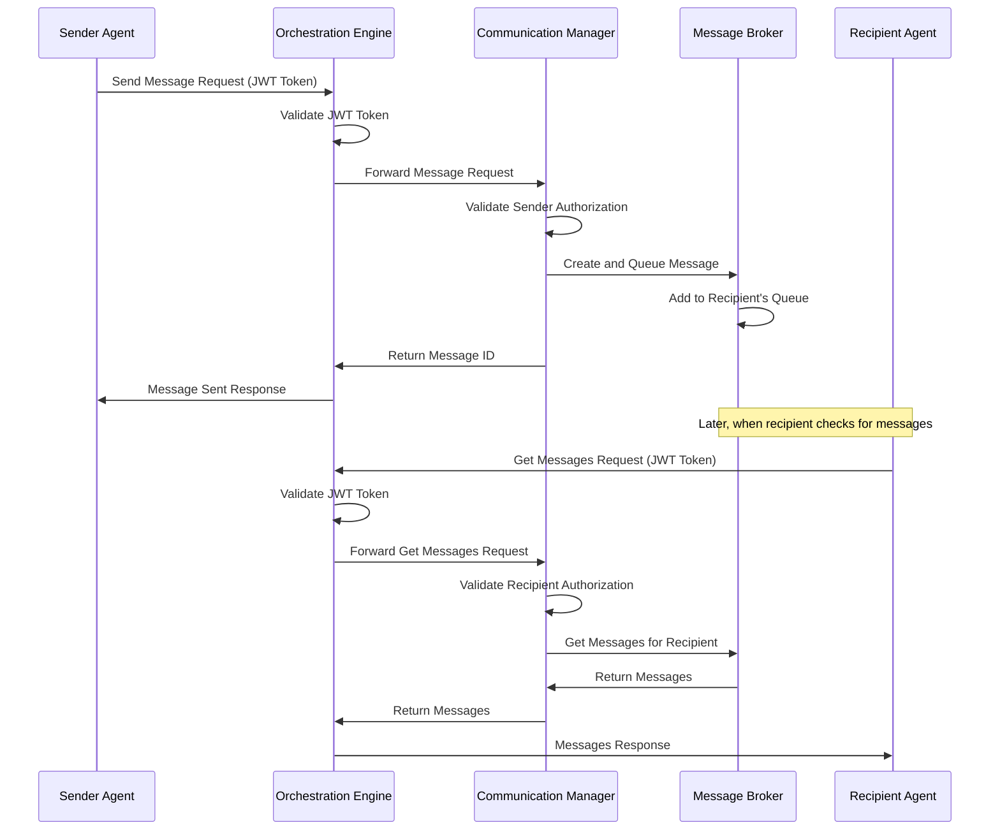

# Agent Communication Protocol

This document defines the communication protocol for the AI-Orchestration-Platform's Agent Communication Module. It specifies the message formats, authentication mechanisms, and interaction patterns between agents.

## Protocol Overview

The Agent Communication Protocol enables secure, reliable, and efficient communication between agents in the AI-Orchestration-Platform. It supports various message types, priorities, and delivery guarantees.



## Message Format

All messages in the Agent Communication Protocol follow this standard format:

```json
{
  "id": "unique-message-id",
  "message_type": "direct|broadcast|task_request|task_response|status_update|error|system",
  "content": {
    // Message-specific content
  },
  "sender_id": "agent-id",
  "recipient_id": "agent-id",  // Optional for broadcast messages
  "correlation_id": "related-message-id",  // Optional
  "priority": "high|medium|low",
  "ttl": 3600,  // Time-to-live in seconds (optional)
  "metadata": {
    // Additional metadata
  },
  "created_at": "2025-03-19T15:30:00Z",
  "delivered": false,
  "delivered_at": null,
  "expires_at": 1742688600  // Unix timestamp (optional)
}
```

### Message Types

The protocol supports the following message types:

1. **DIRECT**: Direct message to a specific agent
   ```json
   {
     "message_type": "direct",
     "content": {
       "text": "Hello, agent2!",
       "timestamp": "2025-03-19T15:30:00Z"
     },
     "sender_id": "agent1",
     "recipient_id": "agent2"
   }
   ```

2. **BROADCAST**: Broadcast message to all agents
   ```json
   {
     "message_type": "broadcast",
     "content": {
       "text": "Attention all agents!",
       "timestamp": "2025-03-19T15:30:00Z"
     },
     "sender_id": "agent1"
   }
   ```

3. **TASK_REQUEST**: Request for a task to be performed
   ```json
   {
     "message_type": "task_request",
     "content": {
       "task_id": "task-123",
       "task_type": "code_generation",
       "parameters": {
         "language": "python",
         "description": "Write a function to calculate the Fibonacci sequence"
       },
       "deadline": 1742688600,
       "timestamp": "2025-03-19T15:30:00Z"
     },
     "sender_id": "agent1",
     "recipient_id": "agent2",
     "priority": "high"
   }
   ```

4. **TASK_RESPONSE**: Response to a task request
   ```json
   {
     "message_type": "task_response",
     "content": {
       "task_id": "task-123",
       "status": "completed",
       "result": {
         "code": "def fibonacci(n): ...",
         "language": "python",
         "explanation": "This function returns the first n numbers in the Fibonacci sequence."
       },
       "timestamp": "2025-03-19T15:35:00Z"
     },
     "sender_id": "agent2",
     "recipient_id": "agent1",
     "correlation_id": "message-id-of-task-request",
     "priority": "high"
   }
   ```

5. **STATUS_UPDATE**: Status update from an agent
   ```json
   {
     "message_type": "status_update",
     "content": {
       "status": "online",
       "load": 2,
       "memory_usage": 256,
       "timestamp": "2025-03-19T15:30:00Z"
     },
     "sender_id": "agent1"
   }
   ```

6. **ERROR**: Error message
   ```json
   {
     "message_type": "error",
     "content": {
       "code": "TASK_EXECUTION_FAILED",
       "message": "Failed to execute task due to insufficient resources",
       "details": {
         "task_id": "task-123",
         "required_memory": 512,
         "available_memory": 256
       },
       "timestamp": "2025-03-19T15:30:00Z"
     },
     "sender_id": "agent2",
     "recipient_id": "agent1",
     "correlation_id": "message-id-of-task-request",
     "priority": "high"
   }
   ```

7. **SYSTEM**: System message
   ```json
   {
     "message_type": "system",
     "content": {
       "type": "shutdown_notice",
       "message": "System will be shutting down for maintenance in 5 minutes",
       "scheduled_downtime": 300,
       "timestamp": "2025-03-19T15:30:00Z"
     },
     "sender_id": "system",
     "priority": "high"
   }
   ```

## Message Priorities

Messages can have one of the following priorities:

- **HIGH**: High priority messages are delivered first
- **MEDIUM**: Medium priority messages are delivered after high priority messages
- **LOW**: Low priority messages are delivered last

## Authentication and Authorization

All communication between agents is authenticated and authorized using JWT tokens. The protocol follows these security principles:

1. **Authentication**: Agents must authenticate with the orchestrator to obtain a JWT token.
2. **Authorization**: Agents can only send messages on behalf of themselves and can only receive messages addressed to them.
3. **Token Validation**: All requests include a JWT token that is validated by the orchestrator.

## Message Delivery Guarantees

The protocol provides the following delivery guarantees:

1. **At-least-once delivery**: Messages are delivered at least once to the recipient.
2. **Message ordering**: Messages from a single sender to a single recipient are delivered in the order they were sent.
3. **Message expiration**: Messages can have a time-to-live (TTL) after which they expire and are removed from the system.

## Error Handling

The protocol defines the following error handling mechanisms:

1. **Error messages**: Agents can send error messages to report problems.
2. **Delivery status**: Agents can check if a message was delivered.
3. **Retry mechanism**: The system automatically retries delivery of failed messages.

## Rate Limiting

To prevent abuse and ensure fair usage, the protocol implements rate limiting:

1. **Message rate limits**: Agents are limited in the number of messages they can send per time period.
2. **Priority-based rate limiting**: Higher priority messages have higher rate limits.
3. **Burst handling**: The system allows for short bursts of messages above the rate limit.

## Extensions

The protocol can be extended with additional features:

1. **Message encryption**: End-to-end encryption of message content.
2. **Message compression**: Compression of large message content.
3. **Message filtering**: Filtering of messages based on content or metadata.
4. **Message acknowledgment**: Explicit acknowledgment of message receipt.
5. **Message forwarding**: Forwarding of messages to other agents.

## Implementation Considerations

When implementing the Agent Communication Protocol, consider the following:

1. **Scalability**: The implementation should scale to handle a large number of agents and messages.
2. **Reliability**: The implementation should be reliable and handle failures gracefully.
3. **Performance**: The implementation should be efficient and have low latency.
4. **Security**: The implementation should be secure and protect against common attacks.
5. **Monitoring**: The implementation should include monitoring and logging for troubleshooting.

## API Endpoints

The protocol is exposed through the following API endpoints:

1. **Send Message**: Send a message to another agent.
2. **Get Messages**: Get messages for an agent.
3. **Register Agent**: Register an agent with the communication system.
4. **Unregister Agent**: Unregister an agent from the communication system.
5. **Get Agent Capabilities**: Get the communication capabilities of an agent.

These endpoints are accessible through the Orchestrator MCP Server.

## Example Workflow

Here's an example workflow for a task request and response:

1. Agent A sends a task request to Agent B:
   ```json
   {
     "message_type": "task_request",
     "content": {
       "task_id": "task-123",
       "task_type": "code_generation",
       "parameters": {
         "language": "python",
         "description": "Write a function to calculate the Fibonacci sequence"
       },
       "deadline": 1742688600,
       "timestamp": "2025-03-19T15:30:00Z"
     },
     "sender_id": "agent-a",
     "recipient_id": "agent-b",
     "priority": "high"
   }
   ```

2. Agent B receives the task request and processes it.

3. Agent B sends a task response to Agent A:
   ```json
   {
     "message_type": "task_response",
     "content": {
       "task_id": "task-123",
       "status": "completed",
       "result": {
         "code": "def fibonacci(n): ...",
         "language": "python",
         "explanation": "This function returns the first n numbers in the Fibonacci sequence."
       },
       "timestamp": "2025-03-19T15:35:00Z"
     },
     "sender_id": "agent-b",
     "recipient_id": "agent-a",
     "correlation_id": "message-id-of-task-request",
     "priority": "high"
   }
   ```

4. Agent A receives the task response and processes it.

## Conclusion

The Agent Communication Protocol provides a standardized way for agents to communicate in the AI-Orchestration-Platform. It enables secure, reliable, and efficient communication between agents, supporting various message types, priorities, and delivery guarantees.
