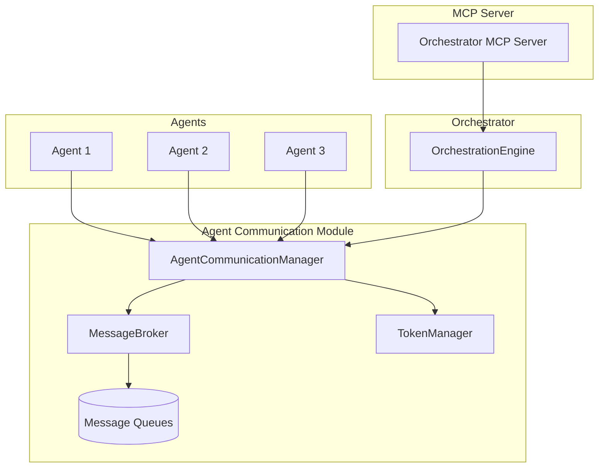

# Agent Communication Module

The Agent Communication Module provides a standardized way for agents to communicate with each other in the AI-Orchestration-Platform. This document explains the module's architecture, features, and how to use it.

## Overview

The Agent Communication Module enables agents to exchange messages, share data, and coordinate their activities. It provides a robust messaging system with features such as:

- Direct messaging between agents
- Broadcast messaging to all agents
- Message priorities and time-to-live (TTL)
- Message correlation for request/response patterns
- Delivery callbacks for real-time message handling
- Authentication and authorization for secure communication

## Architecture

The Agent Communication Module consists of the following components:



### Components

1. **Message**: Represents a message exchanged between agents. It contains metadata such as sender, recipient, message type, priority, and content.

2. **MessageBroker**: Handles message routing and delivery between agents. It manages message queues, priorities, and delivery callbacks.

3. **AgentCommunicationManager**: Provides a high-level API for agent communication, handling authentication, message routing, and error handling.

4. **OrchestrationEngine**: Integrates the Agent Communication Module with the rest of the AI-Orchestration-Platform.

5. **Orchestrator MCP Server**: Exposes the Agent Communication Module's functionality through MCP tools and resources.

## Message Types

The Agent Communication Module supports the following message types:

- **DIRECT**: Direct message to a specific agent
- **BROADCAST**: Broadcast message to all agents
- **TASK_REQUEST**: Request for a task to be performed
- **TASK_RESPONSE**: Response to a task request
- **STATUS_UPDATE**: Status update from an agent
- **ERROR**: Error message
- **SYSTEM**: System message

## Message Priorities

Messages can have one of the following priorities:

- **HIGH**: High priority messages are delivered first
- **MEDIUM**: Medium priority messages are delivered after high priority messages
- **LOW**: Low priority messages are delivered last

## Usage

### Sending a Direct Message

```python
# Send a direct message from agent1 to agent2
message_id = await orchestrator.send_agent_message(
    sender_id="agent1",
    message_type="direct",
    content={"text": "Hello, agent2!"},
    recipient_id="agent2",
    priority="high",
    auth_token="agent1_token"
)
```

### Sending a Broadcast Message

```python
# Send a broadcast message from agent1 to all agents
message_id = await orchestrator.send_agent_message(
    sender_id="agent1",
    message_type="broadcast",
    content={"text": "Attention all agents!"},
    priority="high",
    auth_token="agent1_token"
)
```

### Receiving Messages

```python
# Get messages for agent2
messages = await orchestrator.get_agent_messages(
    agent_id="agent2",
    auth_token="agent2_token"
)

# Process the messages
for message in messages["messages"]:
    print(f"Message from {message['sender_id']}: {message['content']}")
```

### Task Request and Response

```python
# Send a task request from agent1 to agent2
task_request_id = await orchestrator.send_agent_message(
    sender_id="agent1",
    message_type="task_request",
    content={
        "task_type": "code_generation",
        "parameters": {
            "language": "python",
            "description": "Write a function to calculate the Fibonacci sequence"
        }
    },
    recipient_id="agent2",
    priority="high",
    auth_token="agent1_token"
)

# Send a task response from agent2 to agent1
task_response_id = await orchestrator.send_agent_message(
    sender_id="agent2",
    message_type="task_response",
    content={
        "task_id": task_request_id,
        "status": "completed",
        "result": {
            "code": "def fibonacci(n): ..."
        }
    },
    recipient_id="agent1",
    correlation_id=task_request_id,  # Correlate with the task request
    priority="high",
    auth_token="agent2_token"
)
```

### Getting Agent Capabilities

```python
# Get agent1's communication capabilities
capabilities = await orchestrator.get_agent_communication_capabilities(
    agent_id="agent1"
)
```

## MCP Server Integration

The Agent Communication Module is integrated with the Orchestrator MCP Server, which exposes the following tools:

- **send_message**: Send a message from one agent to another
- **get_messages**: Get messages for an agent
- **get_agent_communication_capabilities**: Get the communication capabilities of an agent

These tools can be used by MCP clients to interact with the Agent Communication Module.

## Example

See the [Agent Communication Example](../src/examples/agent_communication_example.py) for a complete example of how to use the Agent Communication Module.

## Security Considerations

The Agent Communication Module includes several security features:

1. **Authentication**: Agents must authenticate with the orchestrator to send and receive messages.

2. **Authorization**: Agents can only send messages on behalf of themselves, and can only receive messages addressed to them.

3. **Message Validation**: Messages are validated to ensure they contain the required fields and have valid values.

4. **Rate Limiting**: The module can be configured to limit the number of messages an agent can send in a given time period.

5. **Message Expiration**: Messages can have a time-to-live (TTL) after which they expire and are removed from the system.

## Best Practices

1. **Use Correlation IDs**: When implementing request/response patterns, always use correlation IDs to link related messages.

2. **Set Appropriate Priorities**: Use message priorities appropriately to ensure important messages are delivered first.

3. **Handle Message Expiration**: Be aware that messages with a TTL may expire before they are delivered. Implement appropriate error handling for this case.

4. **Limit Broadcast Messages**: Use broadcast messages sparingly, as they can generate a lot of traffic in systems with many agents.

5. **Implement Idempotent Handlers**: Message delivery may be retried in case of failures, so ensure your message handlers are idempotent.

## Future Enhancements

1. **Persistent Message Storage**: Add support for storing messages in a persistent database for durability.

2. **Message Filtering**: Allow agents to filter messages based on criteria such as sender, type, or content.

3. **Message Encryption**: Add support for end-to-end encryption of message content.

4. **Advanced Routing**: Implement more sophisticated message routing based on agent capabilities and load.

5. **Metrics and Monitoring**: Add support for collecting metrics and monitoring the health of the messaging system.
