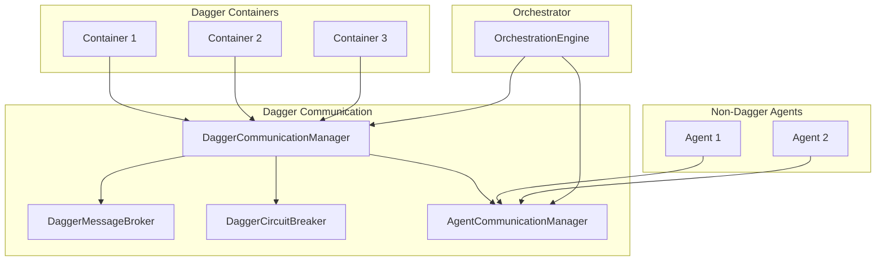

# Dagger Agent Communication

This document describes the Dagger-specific implementation of the agent communication module in the AI-Orchestration-Platform. It explains how to use the Dagger Communication Manager to enable communication between Dagger containers and with non-Dagger agents.

## Overview

The Dagger Agent Communication module extends the base agent communication system to work with Dagger containers. It provides a seamless way for Dagger containers to communicate with each other and with non-Dagger agents in the AI-Orchestration-Platform.



## Key Components

### DaggerCommunicationManager

The `DaggerCommunicationManager` is the main entry point for Dagger container communication. It provides methods for:

- Registering and unregistering Dagger containers
- Sending messages between containers
- Retrieving messages for containers
- Managing delivery callbacks
- Getting container capabilities

### DaggerMessageBroker

The `DaggerMessageBroker` handles the routing and delivery of messages between Dagger containers. It manages:

- Message queues for each container
- Message priorities
- Message expiration
- Delivery callbacks

### Integration with Circuit Breaker

The Dagger Communication module integrates with the Dagger Circuit Breaker to prevent cascading failures. All communication methods have a `use_circuit_breaker` parameter that defaults to `True`.

## Usage

### Getting the Dagger Communication Manager

```python
from src.orchestrator.dagger_communication import get_dagger_communication_manager

# Get the singleton instance
communication_manager = get_dagger_communication_manager()
```

### Registering a Dagger Container

```python
# Register a container with capabilities
await communication_manager.register_container(
    container_id="container1",
    capabilities={
        "dagger_version": "0.3.0",
        "supported_message_types": ["direct", "broadcast", "task_request", "task_response"],
        "max_message_size": 1024 * 1024,  # 1 MB
        "supports_encryption": True
    }
)
```

### Sending Messages

```python
from src.orchestrator.communication import MessageType, MessagePriority

# Send a direct message
message_id = await communication_manager.send_message(
    sender_id="container1",
    message_type=MessageType.DIRECT,
    content={"text": "Hello, container2!"},
    recipient_id="container2",
    priority=MessagePriority.HIGH,
    ttl=60,  # 1 minute
)

# Send a broadcast message
message_id = await communication_manager.send_message(
    sender_id="container1",
    message_type=MessageType.BROADCAST,
    content={"text": "Hello, everyone!"},
    priority=MessagePriority.MEDIUM,
)
```

### Receiving Messages

```python
# Get messages for a container
messages = await communication_manager.get_messages(
    container_id="container2",
    mark_delivered=True  # Mark messages as delivered
)

# Process the messages
for message in messages:
    print(f"Message from {message['sender_id']}: {message['content']}")
```

### Unregistering a Container

```python
# Unregister a container
await communication_manager.unregister_container(
    container_id="container1"
)
```

### Shutting Down

```python
# Shutdown the communication manager
await communication_manager.shutdown()
```

## Cross-System Communication

The Dagger Communication Manager supports communication between Dagger containers and non-Dagger agents. When a message is sent from a Dagger container to a non-Dagger agent (or vice versa), the message is automatically routed through the appropriate communication system.

```python
# Send a message from a Dagger container to a non-Dagger agent
await communication_manager.send_message(
    sender_id="container1",
    message_type=MessageType.DIRECT,
    content={"text": "Hello, agent!"},
    recipient_id="agent1",
    priority=MessagePriority.MEDIUM,
)

# Send a message from a non-Dagger agent to a Dagger container
from src.orchestrator.communication import get_communication_manager
base_manager = get_communication_manager()

await base_manager.send_message(
    sender_id="agent1",
    message_type=MessageType.DIRECT,
    content={"text": "Hello, container!"},
    recipient_id="container1",
    priority=MessagePriority.MEDIUM,
)
```

## Error Handling

The Dagger Communication Manager includes robust error handling with circuit breaker integration. When the circuit breaker is open, a `SystemError` with code `ErrorCode.SYSTEM_CIRCUIT_BREAKER_OPEN` is raised.

```python
from src.orchestrator.error_handling import SystemError, ErrorCode

try:
    await communication_manager.send_message(...)
except SystemError as e:
    if e.code == ErrorCode.SYSTEM_CIRCUIT_BREAKER_OPEN:
        print(f"Circuit breaker is open: {str(e)}")
    else:
        print(f"System error: {str(e)}")
except Exception as e:
    print(f"Error: {str(e)}")
```

## Integration with Dagger SDK

The Dagger Communication Manager can be integrated with the Dagger SDK to enable communication between Dagger containers in a pipeline.

```python
import dagger

async def run_pipeline():
    # Get the communication manager
    communication_manager = get_dagger_communication_manager()
    
    try:
        # Create a Dagger client
        async with dagger.Connection() as client:
            # Create containers
            container1 = client.container().from_("alpine:latest")
            container2 = client.container().from_("alpine:latest")
            
            # Register containers with the communication manager
            await communication_manager.register_container(
                container_id="container1",
                capabilities={"dagger_version": "0.3.0"}
            )
            
            await communication_manager.register_container(
                container_id="container2",
                capabilities={"dagger_version": "0.3.0"}
            )
            
            # Send a message from container1 to container2
            await communication_manager.send_message(
                sender_id="container1",
                message_type=MessageType.DIRECT,
                content={"command": "echo 'Hello from container1'"},
                recipient_id="container2",
                priority=MessagePriority.HIGH,
            )
            
            # Get messages for container2
            messages = await communication_manager.get_messages("container2")
            
            # Process messages
            for message in messages:
                if message["message_type"] == MessageType.DIRECT:
                    command = message["content"].get("command")
                    if command:
                        # Execute the command in container2
                        result = await container2.with_exec(["/bin/sh", "-c", command]).stdout()
                        print(f"Command result: {result}")
            
            # Unregister containers
            await communication_manager.unregister_container("container1")
            await communication_manager.unregister_container("container2")
    
    finally:
        # Shutdown the communication manager
        await communication_manager.shutdown()
```

## Best Practices

1. **Use Circuit Breaker**: Always use the circuit breaker to prevent cascading failures. Only disable it if you have a specific reason to do so.

2. **Handle Errors**: Implement proper error handling to catch and handle communication errors, especially circuit breaker errors.

3. **Set Appropriate TTL**: Set an appropriate time-to-live (TTL) for messages based on their importance and urgency.

4. **Use Message Priorities**: Use message priorities to ensure that important messages are delivered first.

5. **Unregister Containers**: Always unregister containers when they are no longer needed to free up resources.

6. **Shutdown Properly**: Always shutdown the communication manager when it's no longer needed to clean up resources.

## Example

See the [Dagger Communication Example](../../examples/dagger/dagger_communication_example.py) for a complete example of how to use the Dagger Communication Manager.

## Conclusion

The Dagger Agent Communication module provides a robust and flexible way for Dagger containers to communicate with each other and with non-Dagger agents in the AI-Orchestration-Platform. It integrates with the Dagger Circuit Breaker to prevent cascading failures and provides a seamless experience for developers.
