# Data Flow Documentation for AI-Orchestration-Platform

This document describes the data flow between different components of the AI-Orchestration-Platform, with a focus on the integration between AI-Orchestrator and Fast-Agent.

## Authentication Mechanism Data Flow

The authentication mechanism ensures secure communication between AI-Orchestrator and Fast-Agent components. This section describes the data flow for different authentication scenarios.

### 1. Initial Authentication Flow

This flow describes how Fast-Agent initially authenticates with AI-Orchestrator.

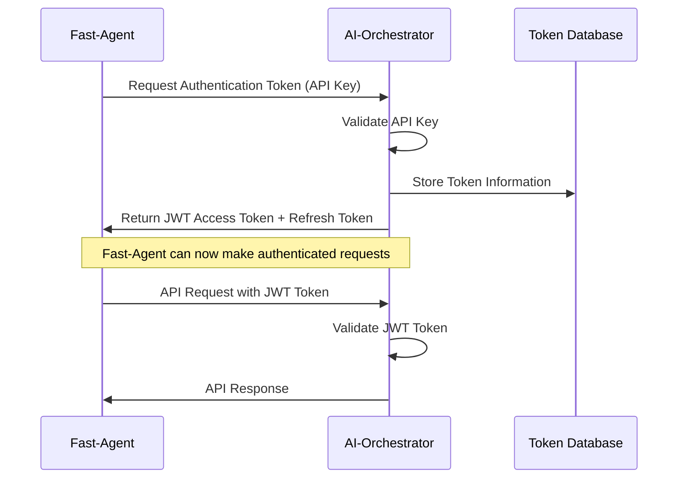

**Data Exchanged:**
1. **Request Authentication Token:**
   - API Key: Secret key assigned to Fast-Agent
   - Client ID: Identifier for Fast-Agent
   - Requested Scope: Permissions being requested

2. **JWT Access Token:**
   - Token: Encoded JWT string
   - Token Type: "Bearer"
   - Expiration: Time in seconds until token expires
   - Refresh Token: Token for obtaining a new access token
   - Scope: Granted permissions

3. **API Request:**
   - Authorization Header: "Bearer {jwt_token}"
   - Request Payload: Depends on the API endpoint

### 2. Token Refresh Flow

This flow describes how Fast-Agent refreshes an expired JWT token.

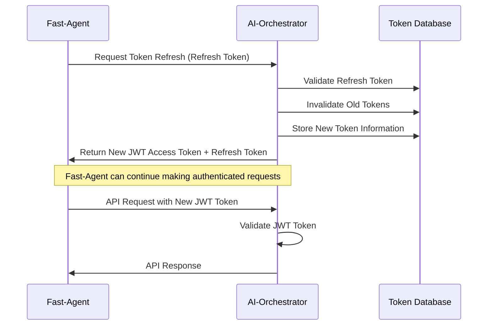

**Data Exchanged:**
1. **Request Token Refresh:**
   - Refresh Token: Previously issued refresh token
   - Client ID: Identifier for Fast-Agent

2. **New JWT Access Token:**
   - Token: Encoded JWT string
   - Token Type: "Bearer"
   - Expiration: Time in seconds until token expires
   - Refresh Token: New token for obtaining a new access token
   - Scope: Granted permissions

### 3. Agent Registration Flow

This flow describes how Fast-Agent registers a new agent with AI-Orchestrator.

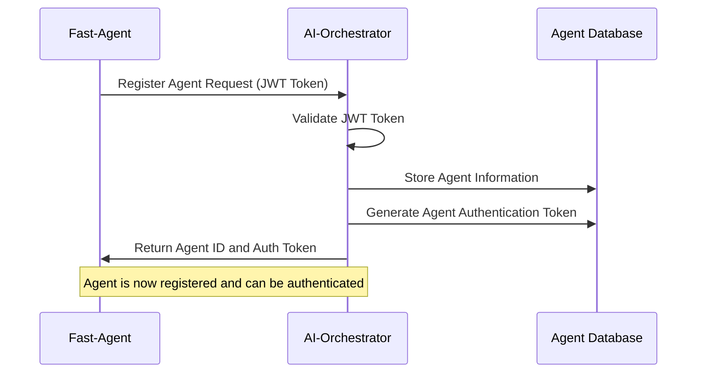

**Data Exchanged:**
1. **Register Agent Request:**
   - Authorization Header: "Bearer {jwt_token}"
   - Agent Name: Human-readable name for the agent
   - Agent Description: Description of the agent's purpose
   - Agent Capabilities: Model, servers, provider, etc.
   - Authentication Type: API key, JWT, OAuth, etc.
   - Authentication Credentials: Depends on auth type

2. **Agent Registration Response:**
   - Agent ID: Unique identifier for the agent
   - Authentication Token: Token for authenticating the agent
   - Expiration: Time in seconds until token expires

### 4. Agent Authentication Flow

This flow describes how Fast-Agent authenticates a registered agent with AI-Orchestrator.

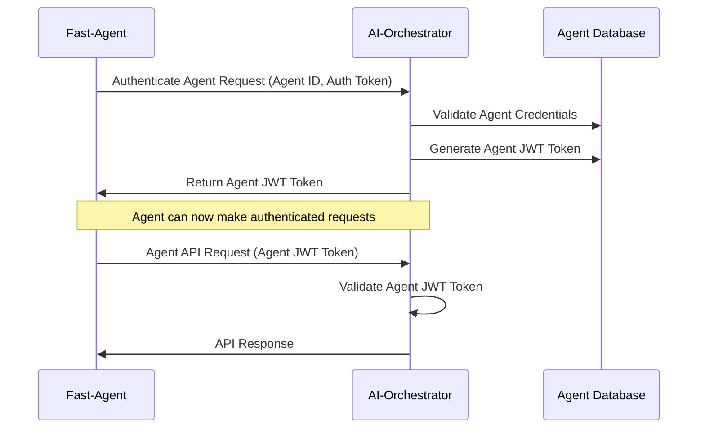

**Data Exchanged:**
1. **Authenticate Agent Request:**
   - Agent ID: Unique identifier for the agent
   - Authentication Token: Token received during registration

2. **Agent JWT Token:**
   - Token: Encoded JWT string
   - Token Type: "Bearer"
   - Expiration: Time in seconds until token expires
   - Scope: Granted permissions

3. **Agent API Request:**
   - Authorization Header: "Bearer {agent_jwt_token}"
   - Request Payload: Depends on the API endpoint

### 5. Token Revocation Flow

This flow describes how Fast-Agent revokes a token when it's no longer needed.

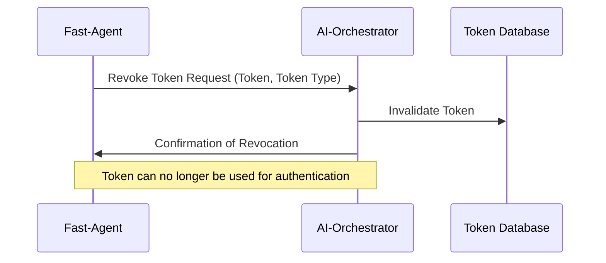

**Data Exchanged:**
1. **Revoke Token Request:**
   - Token: The token to revoke
   - Token Type Hint: "access_token" or "refresh_token"

2. **Revocation Confirmation:**
   - Success: Boolean indicating successful revocation

## Component Integration Data Flow

This section describes the data flow between AI-Orchestrator and Fast-Agent components during normal operation.

### 1. Task Execution Flow

This flow describes how AI-Orchestrator delegates a task to Fast-Agent.

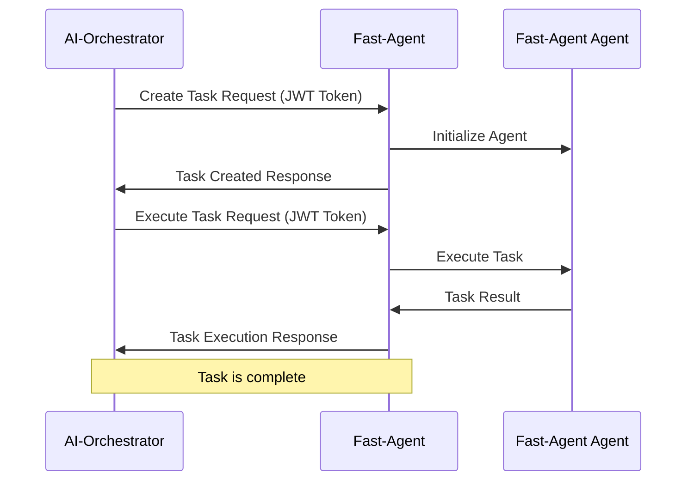

**Data Exchanged:**
1. **Create Task Request:**
   - Authorization Header: "Bearer {jwt_token}"
   - Task Name: Name of the task
   - Task Description: Description of the task
   - Agent ID: ID of the agent to assign the task to
   - Task Parameters: Parameters for the task

2. **Task Created Response:**
   - Task ID: Unique identifier for the task
   - Status: "created"

3. **Execute Task Request:**
   - Authorization Header: "Bearer {jwt_token}"
   - Task ID: ID of the task to execute
   - Execution Parameters: Parameters for the execution

4. **Task Execution Response:**
   - Task ID: ID of the executed task
   - Status: "completed" or "failed"
   - Result: Result of the task execution
   - Error: Error message if the task failed

### 2. Agent Query Flow

This flow describes how AI-Orchestrator queries a Fast-Agent agent.

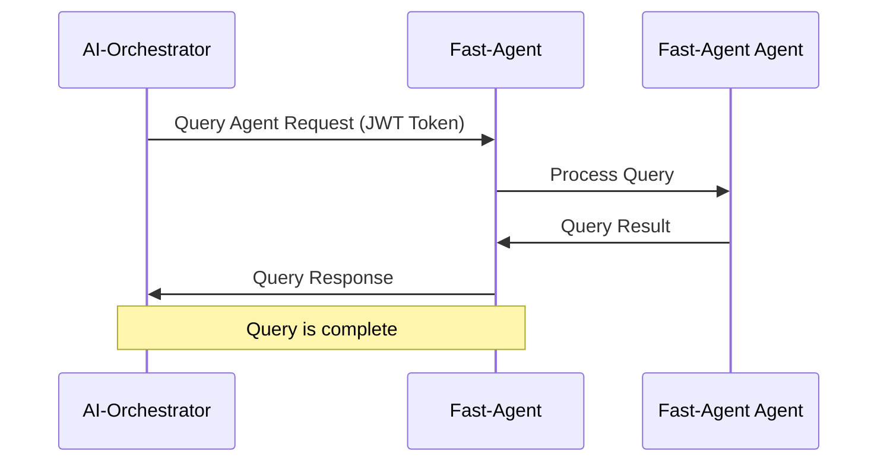

**Data Exchanged:**
1. **Query Agent Request:**
   - Authorization Header: "Bearer {jwt_token}"
   - Agent ID: ID of the agent to query
   - Query: The query to process
   - Query Parameters: Parameters for the query

2. **Query Response:**
   - Agent ID: ID of the queried agent
   - Status: "completed" or "failed"
   - Result: Result of the query
   - Error: Error message if the query failed

## Error Handling Data Flow

This section describes the data flow for error handling scenarios, following the standardized Error Handling Protocol.

### 1. Authentication Failure Flow

This flow describes what happens when authentication fails.

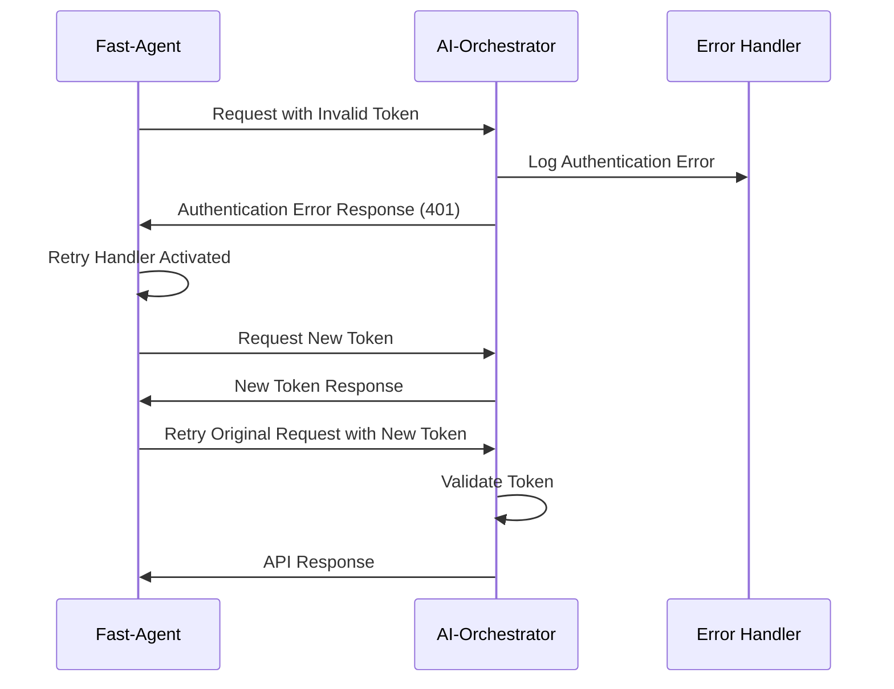

**Data Exchanged:**
1. **Authentication Error Response:**
   - Status Code: 401 Unauthorized
   - Error Response Body:
   ```json
   {
     "error": {
       "code": "AUTH.INVALID_CREDENTIALS",
       "message": "The access token is invalid or has expired",
       "severity": "ERROR",
       "component": "AUTH",
       "request_id": "unique-request-id",
       "timestamp": "2025-03-09T01:30:00Z",
       "documentation_url": "https://example.com/docs/errors/auth-invalid-credentials"
     }
   }
   ```

### 2. Authorization Failure Flow

This flow describes what happens when a request is not authorized.

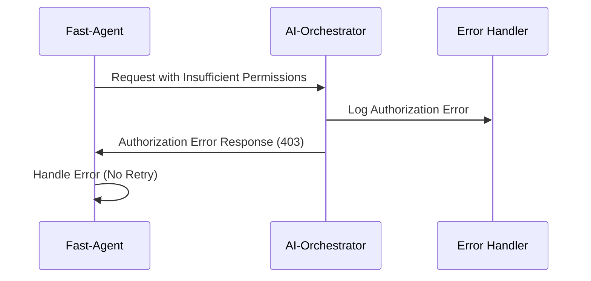

**Data Exchanged:**
1. **Authorization Error Response:**
   - Status Code: 403 Forbidden
   - Error Response Body:
   ```json
   {
     "error": {
       "code": "AUTH.INSUFFICIENT_SCOPE",
       "message": "The request requires higher privileges than provided by the access token",
       "details": {
         "required_scopes": ["admin", "write"],
         "provided_scopes": ["read"]
       },
       "severity": "ERROR",
       "component": "AUTH",
       "request_id": "unique-request-id",
       "timestamp": "2025-03-09T01:30:00Z",
       "documentation_url": "https://example.com/docs/errors/auth-insufficient-scope"
     }
   }
   ```

### 3. Server Error Flow with Retry

This flow describes what happens when a server error occurs and the client implements retry logic.

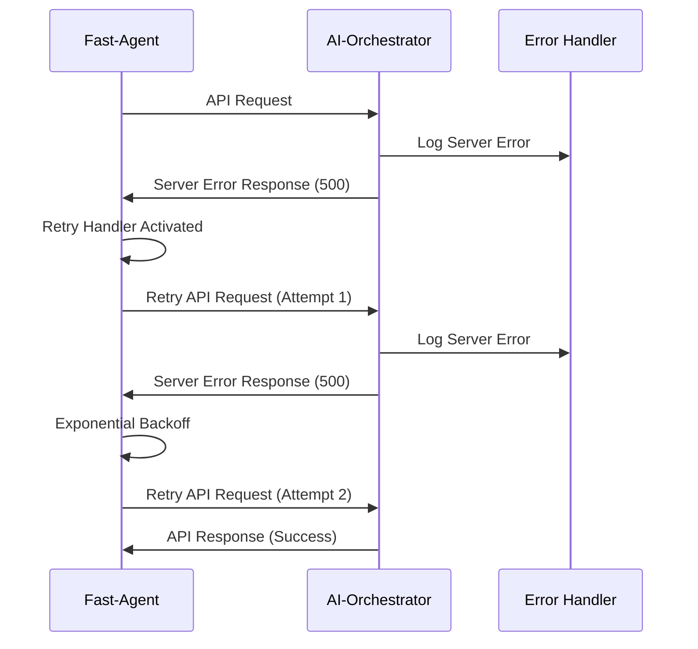

**Data Exchanged:**
1. **Server Error Response:**
   - Status Code: 500 Internal Server Error
   - Error Response Body:
   ```json
   {
     "error": {
       "code": "SYSTEM.INTERNAL_ERROR",
       "message": "An unexpected error occurred on the server",
       "severity": "ERROR",
       "component": "SYSTEM",
       "request_id": "unique-request-id",
       "timestamp": "2025-03-09T01:30:00Z",
       "documentation_url": "https://example.com/docs/errors/system-internal-error"
     }
   }
   ```

### 4. Rate Limit Error Flow

This flow describes what happens when a rate limit is exceeded.

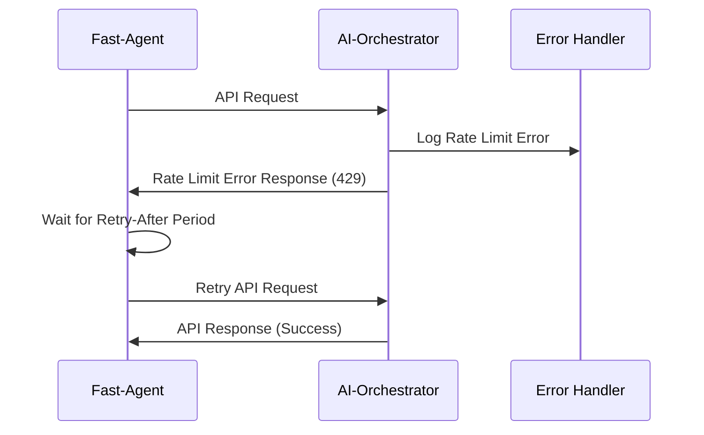

**Data Exchanged:**
1. **Rate Limit Error Response:**
   - Status Code: 429 Too Many Requests
   - Headers:
     - Retry-After: 60 (seconds)
   - Error Response Body:
   ```json
   {
     "error": {
       "code": "RATE_LIMIT.EXCEEDED",
       "message": "Rate limit exceeded. Please retry after 60 seconds",
       "details": {
         "limit": 100,
         "current": 120,
         "retry_after": 60
       },
       "severity": "ERROR",
       "component": "RATE_LIMIT",
       "request_id": "unique-request-id",
       "timestamp": "2025-03-09T01:30:00Z",
       "documentation_url": "https://example.com/docs/errors/rate-limit-exceeded"
     }
   }
   ```

### 5. Circuit Breaker Flow

This flow describes how the circuit breaker pattern is implemented to prevent cascading failures.

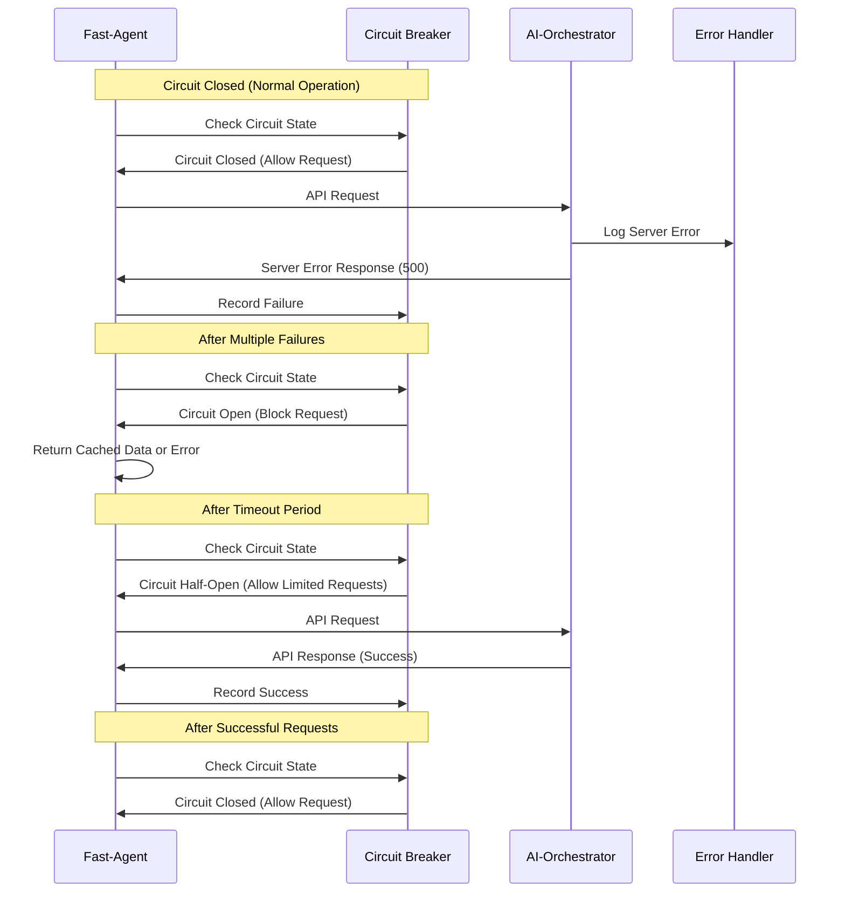

**Data Exchanged:**
1. **Circuit Breaker Open Error:**
   - Generated by Fast-Agent when circuit is open
   - Error Response Body:
   ```json
   {
     "error": {
       "code": "INTEGRATION.CONNECTION_FAILED",
       "message": "Circuit breaker is open. Too many failures detected",
       "details": {
         "failures": 5,
         "timeout": 60,
         "service": "AI-Orchestrator"
       },
       "severity": "ERROR",
       "component": "FAST_AGENT",
       "request_id": "unique-request-id",
       "timestamp": "2025-03-09T01:30:00Z",
       "documentation_url": "https://example.com/docs/errors/integration-connection-failed"
     }
   }
   ```

## Agent Communication Data Flow

This section describes the data flow for agent communication in the AI-Orchestration-Platform.

### 1. Direct Message Flow

This flow describes how one agent sends a direct message to another agent.

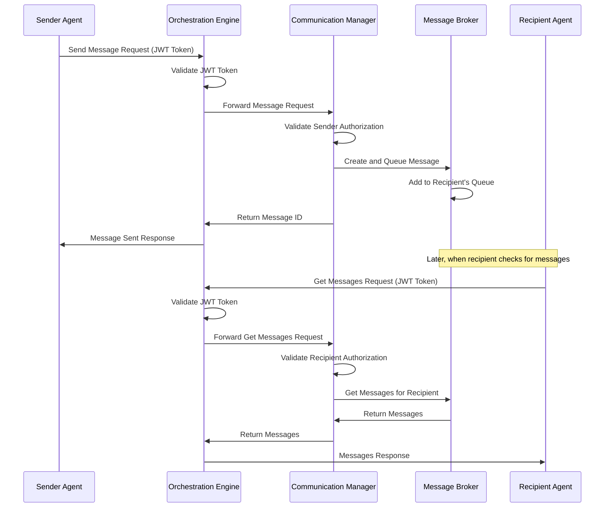

**Data Exchanged:**
1. **Send Message Request:**
   - Authorization Header: "Bearer {jwt_token}"
   - Sender ID: ID of the sending agent
   - Message Type: Type of the message (direct, broadcast, etc.)
   - Content: Content of the message
   - Recipient ID: ID of the receiving agent
   - Priority: Priority of the message (high, medium, low)
   - TTL: Time-to-live in seconds (optional)
   - Metadata: Additional metadata for the message (optional)

2. **Message Sent Response:**
   - Message ID: Unique identifier for the message
   - Status: "sent"
   - Timestamp: Time the message was sent

3. **Get Messages Request:**
   - Authorization Header: "Bearer {jwt_token}"
   - Agent ID: ID of the agent requesting messages
   - Mark Delivered: Whether to mark messages as delivered

4. **Messages Response:**
   - Agent ID: ID of the agent
   - Messages: Array of messages
   - Count: Number of messages
   - Timestamp: Time the messages were retrieved

### 2. Broadcast Message Flow

This flow describes how an agent sends a broadcast message to all other agents.

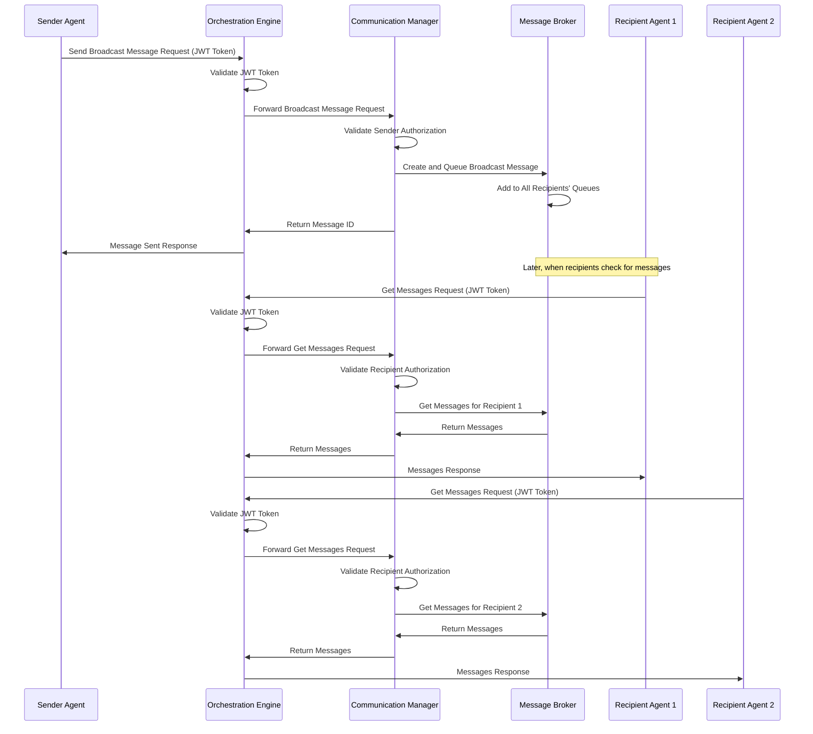

**Data Exchanged:**
1. **Send Broadcast Message Request:**
   - Authorization Header: "Bearer {jwt_token}"
   - Sender ID: ID of the sending agent
   - Message Type: "broadcast"
   - Content: Content of the message
   - Priority: Priority of the message (high, medium, low)
   - TTL: Time-to-live in seconds (optional)
   - Metadata: Additional metadata for the message (optional)

2. **Message Sent Response:**
   - Message ID: Unique identifier for the message
   - Status: "sent"
   - Timestamp: Time the message was sent

### 3. Task Request and Response Flow

This flow describes how one agent sends a task request to another agent and receives a response.

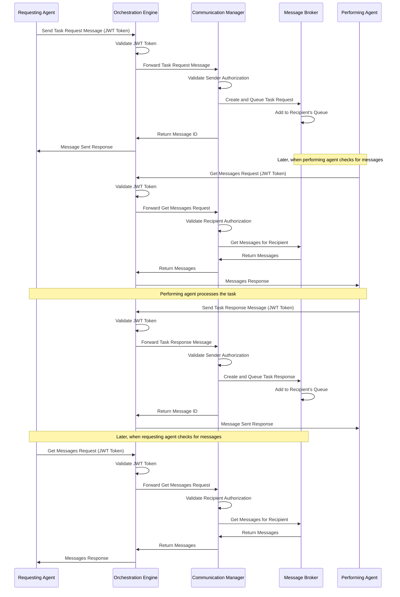

**Data Exchanged:**
1. **Send Task Request Message:**
   - Authorization Header: "Bearer {jwt_token}"
   - Sender ID: ID of the requesting agent
   - Message Type: "task_request"
   - Content: Task details (type, parameters, deadline, etc.)
   - Recipient ID: ID of the performing agent
   - Priority: Priority of the task (high, medium, low)
   - TTL: Time-to-live in seconds (optional)
   - Metadata: Additional metadata for the task (optional)

2. **Send Task Response Message:**
   - Authorization Header: "Bearer {jwt_token}"
   - Sender ID: ID of the performing agent
   - Message Type: "task_response"
   - Content: Task result (status, result data, etc.)
   - Recipient ID: ID of the requesting agent
   - Correlation ID: ID of the task request message
   - Priority: Priority of the response (high, medium, low)
   - Metadata: Additional metadata for the response (optional)

## Data Storage

This section describes how authentication data is stored in the system.

### 1. Token Database

The token database stores information about issued tokens.

**Schema:**
```
tokens {
    token_id: string (primary key)
    access_token: string
    refresh_token: string
    client_id: string
    scope: string[]
    issued_at: timestamp
    expires_at: timestamp
    is_revoked: boolean
}
```

### 2. Agent Database

The agent database stores information about registered agents.

**Schema:**
```
agents {
    agent_id: string (primary key)
    name: string
    description: string
    capabilities: json
    auth_type: string
    auth_credentials: json
    auth_token: string
    token_expires_at: timestamp
    created_at: timestamp
    updated_at: timestamp
    is_active: boolean
}
```

## Security Considerations

1. **Data in Transit:**
   - All data exchanged between AI-Orchestrator and Fast-Agent should be encrypted using TLS
   - Sensitive data should never be included in URL parameters

2. **Data at Rest:**
   - Tokens and credentials should be stored securely, preferably encrypted
   - Access to token and agent databases should be restricted

3. **Data Validation:**
   - All input data should be validated before processing
   - Token and credential validation should use secure comparison methods

4. **Data Retention:**
   - Expired tokens should be removed from the database after a certain period
   - Revoked tokens should be kept for a period to prevent reuse

5. **Data Logging:**
   - Authentication events should be logged for audit purposes
   - Logs should not contain sensitive data like tokens or credentials
