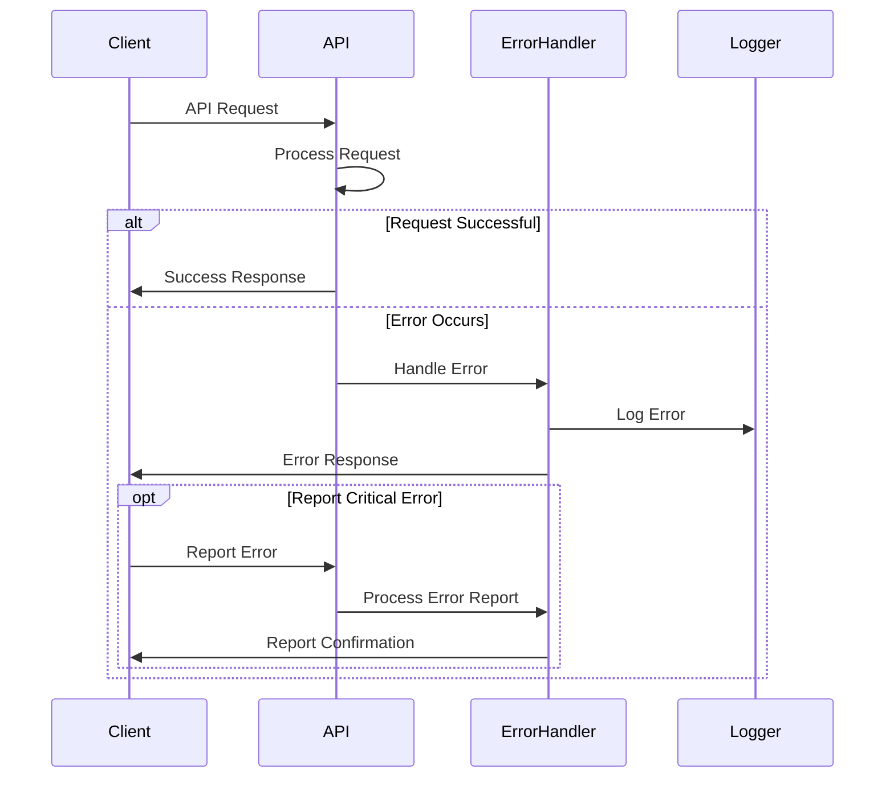
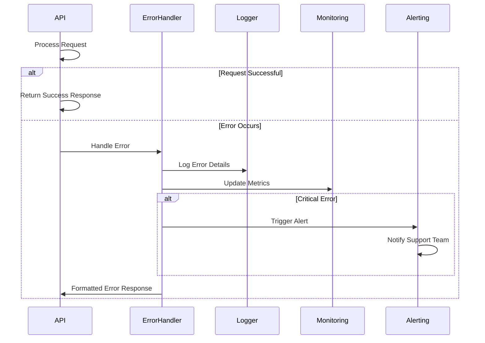
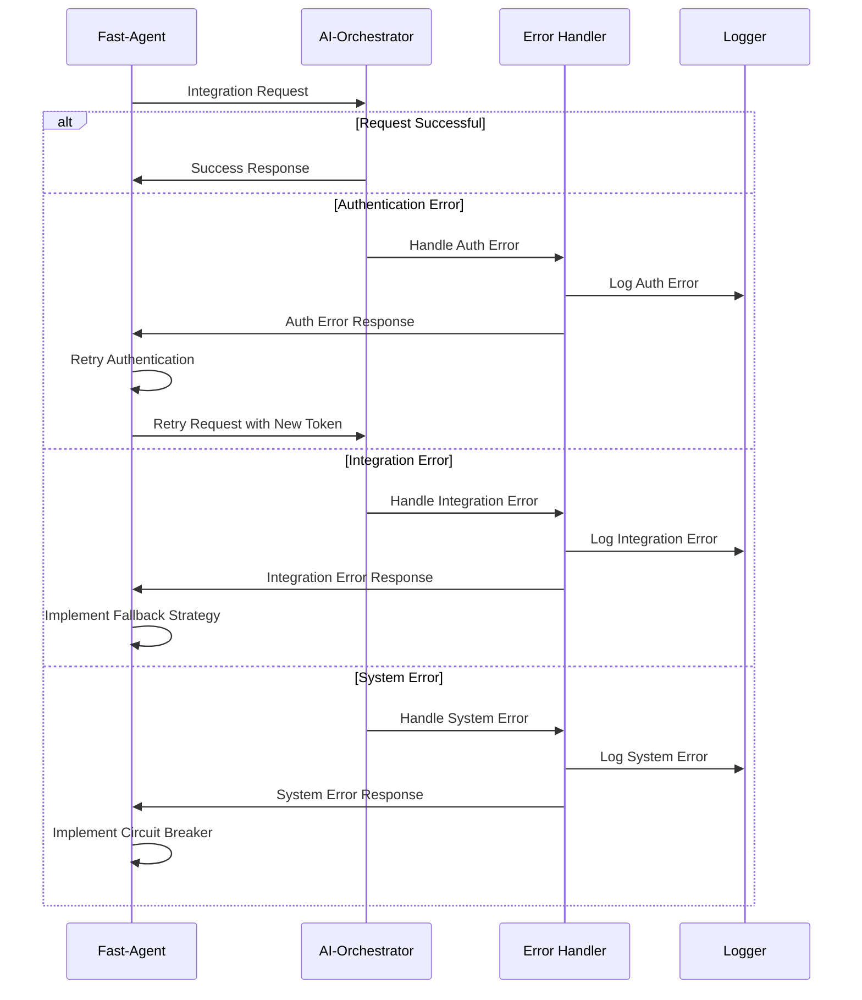

# Error Handling Protocol for AI-Orchestration-Platform

This document outlines the standardized error handling protocol for the AI-Orchestration-Platform, with a focus on the integration between AI-Orchestrator and Fast-Agent.

## 1. Error Types and Classification

### 1.1 Error Categories

Errors in the AI-Orchestration-Platform are classified into the following categories:

| Category | Description | HTTP Status Code Range |
|----------|-------------|------------------------|
| Authentication Errors | Errors related to authentication failures | 401 |
| Authorization Errors | Errors related to insufficient permissions | 403 |
| Input Validation Errors | Errors related to invalid input parameters | 400 |
| Resource Errors | Errors related to missing or unavailable resources | 404 |
| Integration Errors | Errors related to integration between components | 502, 503, 504 |
| System Errors | Errors related to internal system failures | 500 |
| Rate Limiting Errors | Errors related to rate limiting or quota exceeded | 429 |

### 1.2 Error Severity Levels

Each error is assigned a severity level to indicate its impact:

| Severity | Description |
|----------|-------------|
| CRITICAL | System-wide failure requiring immediate attention |
| ERROR | Significant issue affecting a specific operation |
| WARNING | Potential issue that doesn't prevent operation |
| INFO | Informational message about an unusual condition |

## 2. Error Response Format

### 2.1 Standard Error Response Structure

All API endpoints return errors in a consistent format:

```json
{
  "error": {
    "code": "string",
    "message": "string",
    "details": {
      "key": "value"
    },
    "severity": "ERROR|WARNING|CRITICAL|INFO",
    "request_id": "string",
    "timestamp": "ISO-8601 timestamp",
    "documentation_url": "string"
  }
}
```

**Fields:**
- `code`: A unique error code that identifies the error type
- `message`: A human-readable error message
- `details`: Additional error details specific to the error type
- `severity`: The severity level of the error
- `request_id`: A unique identifier for the request that can be used for troubleshooting
- `timestamp`: The time when the error occurred
- `documentation_url`: A URL pointing to documentation about the error

### 2.2 Error Codes

Error codes follow a structured format: `{COMPONENT}.{CATEGORY}.{SPECIFIC_ERROR}`

Examples:
- `AUTH.AUTHENTICATION.INVALID_TOKEN`
- `ORCHESTRATOR.RESOURCE.AGENT_NOT_FOUND`
- `FAST_AGENT.INTEGRATION.CONNECTION_FAILED`

## 3. Error Handling Endpoints

### 3.1 Error Reporting Endpoint

**Endpoint:** `/api/v1/errors/report`

**Method:** POST

**Request:**
```json
{
  "error_code": "string",
  "component": "string",
  "message": "string",
  "details": {
    "key": "value"
  },
  "severity": "ERROR|WARNING|CRITICAL|INFO",
  "context": {
    "key": "value"
  },
  "timestamp": "ISO-8601 timestamp"
}
```

**Response:**
```json
{
  "report_id": "string",
  "status": "received|processing|resolved",
  "timestamp": "ISO-8601 timestamp"
}
```

**Status Codes:**
- 202: Error report accepted
- 400: Invalid error report
- 401: Unauthorized
- 500: Server error

### 3.2 Error Status Endpoint

**Endpoint:** `/api/v1/errors/status/{report_id}`

**Method:** GET

**Response:**
```json
{
  "report_id": "string",
  "error_code": "string",
  "status": "received|processing|resolved",
  "resolution": "string",
  "created_at": "ISO-8601 timestamp",
  "updated_at": "ISO-8601 timestamp"
}
```

**Status Codes:**
- 200: Success
- 404: Error report not found
- 401: Unauthorized
- 500: Server error

### 3.3 System Status Endpoint

**Endpoint:** `/api/v1/system/status`

**Method:** GET

**Response:**
```json
{
  "status": "operational|degraded|maintenance|outage",
  "components": [
    {
      "name": "string",
      "status": "operational|degraded|maintenance|outage",
      "message": "string",
      "last_updated": "ISO-8601 timestamp"
    }
  ],
  "incidents": [
    {
      "id": "string",
      "title": "string",
      "status": "investigating|identified|monitoring|resolved",
      "created_at": "ISO-8601 timestamp",
      "updated_at": "ISO-8601 timestamp"
    }
  ],
  "timestamp": "ISO-8601 timestamp"
}
```

**Status Codes:**
- 200: Success
- 401: Unauthorized
- 500: Server error

## 4. Error Handling Flow

### 4.1 Client-Side Error Handling



### 4.2 Server-Side Error Handling



### 4.3 Integration Error Handling



## 5. Error Handling Implementation

### 5.1 Error Handler Interface

```python
class ErrorHandler:
    """Interface for error handling in the AI-Orchestration-Platform."""
    
    def handle_error(self, error, context=None):
        """Handle an error and return a formatted error response.
        
        Args:
            error: The error to handle
            context: Additional context for the error
            
        Returns:
            Formatted error response
        """
        pass
    
    def log_error(self, error, context=None):
        """Log an error for monitoring and debugging.
        
        Args:
            error: The error to log
            context: Additional context for the error
        """
        pass
    
    def report_error(self, error_report):
        """Report an error to the error tracking system.
        
        Args:
            error_report: The error report to submit
            
        Returns:
            Report ID and status
        """
        pass
```

### 5.2 Error Handling Middleware

For API endpoints, an error handling middleware intercepts exceptions and formats them according to the standard error response structure.

```python
class ErrorHandlingMiddleware:
    """Middleware for handling errors in API requests."""
    
    def __init__(self, app, error_handler):
        """Initialize the middleware.
        
        Args:
            app: The application to wrap
            error_handler: The error handler to use
        """
        self.app = app
        self.error_handler = error_handler
    
    async def __call__(self, scope, receive, send):
        """Process a request and handle any errors.
        
        Args:
            scope: The request scope
            receive: The receive function
            send: The send function
        """
        try:
            await self.app(scope, receive, send)
        except Exception as e:
            # Handle the error and send a formatted response
            error_response = self.error_handler.handle_error(e, {"scope": scope})
            # Send the error response
            # ...
```

### 5.3 Client-Side Error Handling

Client libraries should implement error handling that can:

1. Detect and categorize errors based on the error response
2. Implement retry logic for transient errors
3. Implement circuit breaker patterns for persistent errors
4. Provide clear error messages to the application

```python
class ClientErrorHandler:
    """Error handler for client libraries."""
    
    def __init__(self, max_retries=3, backoff_factor=0.5):
        """Initialize the error handler.
        
        Args:
            max_retries: Maximum number of retries for transient errors
            backoff_factor: Backoff factor for retry delays
        """
        self.max_retries = max_retries
        self.backoff_factor = backoff_factor
        self.circuit_breaker = CircuitBreaker()
    
    async def handle_request(self, request_func, *args, **kwargs):
        """Handle a request with error handling and retries.
        
        Args:
            request_func: The function to call to make the request
            *args: Arguments for the request function
            **kwargs: Keyword arguments for the request function
            
        Returns:
            The response from the request
            
        Raises:
            ClientError: If the request fails after retries
        """
        if not self.circuit_breaker.allow_request():
            raise CircuitBreakerError("Circuit breaker is open")
        
        retries = 0
        last_error = None
        
        while retries <= self.max_retries:
            try:
                response = await request_func(*args, **kwargs)
                self.circuit_breaker.record_success()
                return response
            except TransientError as e:
                last_error = e
                retries += 1
                if retries <= self.max_retries:
                    # Exponential backoff
                    delay = self.backoff_factor * (2 ** (retries - 1))
                    await asyncio.sleep(delay)
                else:
                    self.circuit_breaker.record_failure()
            except PermanentError as e:
                self.circuit_breaker.record_failure()
                raise ClientError(str(e)) from e
        
        raise ClientError(f"Request failed after {self.max_retries} retries: {last_error}")
```

## 6. Error Monitoring and Alerting

### 6.1 Error Metrics

The following metrics are tracked for error monitoring:

| Metric | Description |
|--------|-------------|
| error_count | Total number of errors by type and component |
| error_rate | Rate of errors as a percentage of total requests |
| error_duration | Time taken to handle errors |
| retry_count | Number of retries for transient errors |
| circuit_breaker_state | State of circuit breakers (open/closed) |

### 6.2 Error Alerting

Alerts are triggered based on the following conditions:

| Condition | Severity | Action |
|-----------|----------|--------|
| Critical error occurs | High | Immediate notification to on-call team |
| Error rate exceeds threshold | Medium | Notification to development team |
| Circuit breaker opens | Medium | Notification to integration team |
| Multiple authentication failures | Low | Logged for security review |

### 6.3 Error Dashboard

A real-time dashboard provides visibility into system errors, including:

- Current error rates by component
- Recent critical errors
- Circuit breaker status
- System health indicators
- Error trends over time

## 7. Error Recovery Strategies

### 7.1 Retry Strategies

| Error Type | Retry Strategy |
|------------|----------------|
| Network Errors | Exponential backoff with jitter |
| Rate Limiting | Fixed delay based on response headers |
| Authentication Errors | Refresh token and retry once |
| Server Errors | Limited retries with exponential backoff |

### 7.2 Circuit Breaker Pattern

The circuit breaker pattern is implemented to prevent cascading failures:

- **Closed State**: Requests flow normally
- **Open State**: Requests are immediately rejected
- **Half-Open State**: Limited requests are allowed to test recovery

Parameters:
- Failure threshold: 5 failures in 60 seconds
- Reset timeout: 30 seconds
- Half-open request limit: 3 requests

### 7.3 Fallback Strategies

When a service is unavailable, the following fallback strategies are implemented:

| Service | Fallback Strategy |
|---------|-------------------|
| Authentication | Use cached tokens with extended expiry |
| Agent Execution | Use local agent if available |
| Task Scheduling | Queue tasks locally for later execution |
| Resource Retrieval | Use cached data with staleness indicator |

## 8. Error Documentation and Support

### 8.1 Error Documentation

Each error code has comprehensive documentation that includes:

- Description of the error
- Possible causes
- Recommended actions
- Code examples for handling the error
- Links to related resources

### 8.2 Support Workflow

When users encounter errors, the following support workflow is followed:

1. User receives error with unique request ID
2. User can report the error through the API or support portal
3. Support team receives error details and context
4. Issue is tracked and resolved
5. User is notified of resolution

### 8.3 Error Knowledge Base

A searchable knowledge base contains articles about common errors and their solutions, categorized by:

- Component (Authentication, Orchestrator, Fast-Agent, etc.)
- Error type (Authentication, Resource, Integration, etc.)
- Severity level
- Frequency of occurrence

## 9. Implementation Checklist

- [ ] Define standard error codes and messages
- [ ] Implement error handling middleware
- [ ] Create error reporting endpoints
- [ ] Implement client-side error handling libraries
- [ ] Set up error monitoring and alerting
- [ ] Document error codes and recovery strategies
- [ ] Create error handling test suite
- [ ] Train support team on error handling procedures
