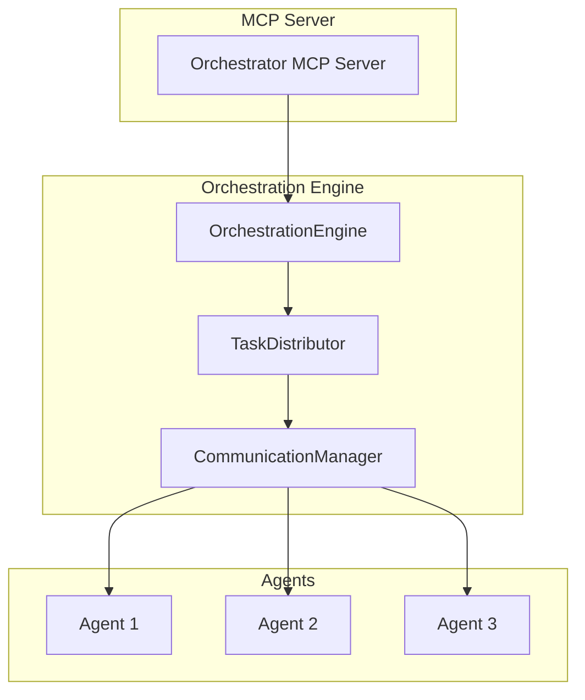
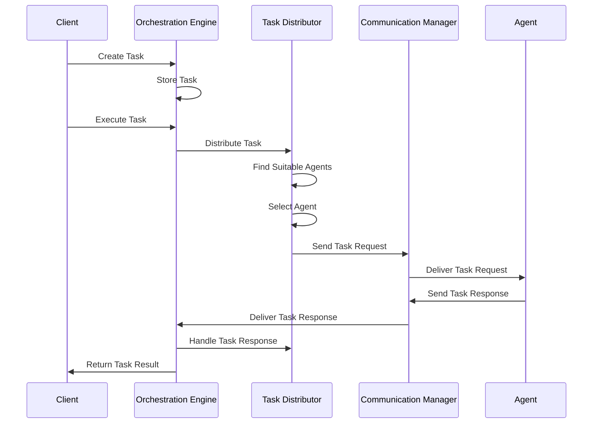

# Task Distribution Logic

This document describes the Task Distribution Logic component of the AI-Orchestration-Platform, which is responsible for distributing tasks to appropriate agents based on their capabilities, availability, and other factors.

## Overview

The Task Distribution Logic enables the orchestrator to intelligently route tasks to the most suitable agents, taking into account various factors such as:

- Agent capabilities
- Current agent load
- Agent priorities
- Distribution strategies
- Task requirements

This component is a critical part of the orchestration system, allowing for efficient utilization of agent resources and ensuring that tasks are executed by agents with the appropriate capabilities.

## Architecture

The Task Distribution Logic consists of the following components:



### Components

1. **TaskDistributor**: The core component responsible for matching tasks to agents and implementing different distribution strategies.

2. **OrchestrationEngine**: Integrates the TaskDistributor with the rest of the orchestration system and provides high-level APIs for task distribution.

3. **CommunicationManager**: Handles message routing and delivery between the orchestrator and agents.

4. **MCP Server**: Exposes the task distribution functionality through MCP tools and resources.

## Distribution Strategies

The Task Distribution Logic supports the following distribution strategies:

1. **Capability Match**: Distributes tasks to agents based on their capabilities. The first agent that matches all required capabilities is selected.

2. **Round Robin**: Distributes tasks evenly among capable agents, ensuring a fair distribution of work.

3. **Load Balanced**: Distributes tasks based on agent load, selecting the agent with the lowest current load.

4. **Priority Based**: Distributes tasks based on agent priority, selecting the agent with the highest priority.

5. **Custom**: Allows for custom distribution strategies to be implemented.

## Task Distribution Flow

The following diagram illustrates the task distribution flow:



## Agent Registration and Management

Agents must register with the Task Distributor to participate in task distribution. During registration, agents provide:

1. **Agent ID**: Unique identifier for the agent
2. **Capabilities**: List of capabilities the agent supports
3. **Priority**: Optional priority value (higher is better)

Agents can update their status (online/offline) and current load to help the Task Distributor make better distribution decisions.

## API Reference

### TaskDistributor API

```python
# Register an agent
await task_distributor.register_agent(
    agent_id="agent-123",
    capabilities=["text_processing", "code_generation"],
    priority=2
)

# Unregister an agent
await task_distributor.unregister_agent("agent-123")

# Update agent status
await task_distributor.update_agent_status(
    agent_id="agent-123",
    is_online=True,
    current_load=5
)

# Distribute a task
result = await task_distributor.distribute_task(
    task_id="task-123",
    task_type="code_generation",
    required_capabilities=["text_processing", "code_generation"],
    task_data={"prompt": "Write a function"},
    sender_id="orchestrator",
    strategy=TaskDistributionStrategy.LOAD_BALANCED,
    priority=MessagePriority.HIGH
)

# Handle a task response
await task_distributor.handle_task_response(
    task_id="task-123",
    agent_id="agent-456",
    status="completed",
    result={"output": "Task completed successfully"}
)
```

### OrchestrationEngine API

```python
# Execute a task with distribution
result = await orchestration_engine.execute_task(
    task_id="task-123",
    parameters={
        "required_capabilities": ["text_processing", "code_generation"],
        "distribution_strategy": "capability_match",
        "priority": "high"
    }
)

# Distribute a task directly
result = await orchestration_engine.distribute_task(
    task_id="task-123",
    required_capabilities=["text_processing", "code_generation"],
    task_data={"prompt": "Write a function"},
    distribution_strategy="load_balanced",
    priority="high",
    auth_token="token-123"
)

# Handle a task response
result = await orchestration_engine.handle_task_response(
    task_id="task-123",
    agent_id="agent-456",
    status="completed",
    result={"output": "Task completed successfully"},
    auth_token="token-123"
)

# Register an agent with the distributor
result = await orchestration_engine.register_agent_with_distributor(
    agent_id="agent-123",
    capabilities=["text_processing", "code_generation"],
    priority=2,
    auth_token="token-123"
)

# Unregister an agent from the distributor
result = await orchestration_engine.unregister_agent_from_distributor(
    agent_id="agent-123",
    auth_token="token-123"
)

# Update agent status in the distributor
result = await orchestration_engine.update_agent_status_in_distributor(
    agent_id="agent-123",
    is_online=True,
    current_load=5,
    auth_token="token-123"
)
```

### MCP Server API

The Orchestrator MCP Server exposes the following tools for task distribution:

1. **distribute_task**: Distribute a task to an appropriate agent
2. **handle_task_response**: Handle a task response from an agent
3. **register_agent_with_distributor**: Register an agent with the task distributor
4. **unregister_agent_from_distributor**: Unregister an agent from the task distributor
5. **update_agent_status_in_distributor**: Update the status of an agent in the task distributor

## Error Handling

The Task Distribution Logic includes robust error handling to deal with various failure scenarios:

1. **No Suitable Agent**: If no agent with the required capabilities is found, a `TaskDistributionError` is raised.

2. **Authentication Errors**: If the authentication token is invalid, an `AuthenticationError` is raised.

3. **Authorization Errors**: If the client doesn't have the required permissions, an `AuthorizationError` is raised.

4. **Communication Errors**: If there's an error communicating with an agent, appropriate error handling is applied.

## Integration with Fast-Agent

The Task Distribution Logic integrates with Fast-Agent through the Fast-Agent adapter, allowing Fast-Agent agents to participate in task distribution. The adapter translates between the AI-Orchestration-Platform's task distribution protocol and Fast-Agent's agent execution protocol.

## Future Enhancements

1. **Advanced Load Balancing**: Implement more sophisticated load balancing algorithms that take into account factors such as agent performance, task complexity, and historical data.

2. **Machine Learning-Based Distribution**: Use machine learning to predict the best agent for a given task based on past performance.

3. **Task Prioritization**: Implement task prioritization to ensure that high-priority tasks are executed first.

4. **Fault Tolerance**: Enhance fault tolerance by automatically redistributing tasks when agents fail.

5. **Dynamic Capability Discovery**: Implement dynamic capability discovery to automatically detect agent capabilities.
