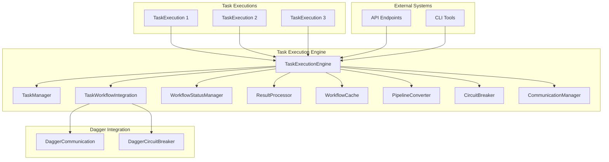

# Task Execution Engine Guide

This guide explains how to use the Task Execution Engine in the AI-Orchestration-Platform.

## Overview

The Task Execution Engine is a powerful component of the AI-Orchestration-Platform that provides:

1. **Task Scheduling**: Schedule tasks for execution with dependencies, priorities, and retry strategies
2. **Dependency Management**: Define task dependencies and ensure they are executed in the correct order
3. **Retry Handling**: Configure retry strategies for failed tasks with various backoff algorithms
4. **Status Tracking**: Monitor the status of task executions in real-time
5. **Result Processing**: Process and store task execution results

The Task Execution Engine integrates with the Task Manager and Dagger Workflow Integration to provide a comprehensive solution for executing tasks as containerized workflows.

## Architecture

The Task Execution Engine consists of several components:



## Key Concepts

### Task Execution

A `TaskExecution` represents a single execution of a task. It includes:

- **Task ID**: The ID of the task to execute
- **Execution ID**: A unique identifier for the execution
- **Workflow Type**: The type of workflow to execute (e.g., containerized_workflow)
- **Priority**: The priority of the execution (LOW, MEDIUM, HIGH, CRITICAL)
- **Workflow Parameters**: Parameters for the workflow
- **Retry Strategy**: Strategy for retrying failed executions
- **Dependencies**: List of execution IDs that must complete before this execution
- **Status**: Current status of the execution (PENDING, SCHEDULED, RUNNING, COMPLETED, etc.)
- **Result**: Result of the execution

### Execution Status

Task executions can have the following statuses:

- **PENDING**: The execution is waiting to be scheduled
- **SCHEDULED**: The execution is scheduled but not yet running
- **PREPARING**: The execution is preparing to run
- **RUNNING**: The execution is currently running
- **PAUSED**: The execution is paused
- **COMPLETED**: The execution has completed successfully
- **FAILED**: The execution has failed
- **CANCELLED**: The execution has been cancelled
- **RETRYING**: The execution is waiting to be retried
- **TIMEOUT**: The execution has timed out

### Retry Strategies

The Task Execution Engine supports several retry strategies:

- **NONE**: No retry
- **IMMEDIATE**: Retry immediately
- **FIXED_DELAY**: Retry with a fixed delay
- **EXPONENTIAL_BACKOFF**: Retry with exponential backoff (delay * 2^retry_count)
- **FIBONACCI_BACKOFF**: Retry with Fibonacci backoff (delay * fibonacci(retry_count))

## Getting Started

### Initializing the Task Execution Engine

The Task Execution Engine is a singleton that can be accessed using the `get_task_execution_engine` function:

```python
from src.task_manager.task_execution_engine import get_task_execution_engine

# Get the task execution engine
engine = get_task_execution_engine()

# Initialize the engine (if not already initialized)
await engine.initialize()
```

### Scheduling a Task

To schedule a task for execution:

```python
# Schedule a task
result = await engine.schedule_task(
    task_id="task_123",
    workflow_type="containerized_workflow",
    priority=TaskExecutionPriority.HIGH,
    workflow_params={
        "inputs": {
            "container_image": "python:3.9-slim",
            "command": ["python", "-c", "print('Hello, world!')"],
        }
    },
    retry_strategy=RetryStrategy.EXPONENTIAL_BACKOFF,
    max_retries=3,
    retry_delay=5,
    timeout=3600,
    dependencies=[],
    metadata={"key": "value"},
)

# Get the execution ID
execution_id = result["execution_id"]
```

### Scheduling Multiple Tasks

To schedule multiple tasks at once:

```python
# Schedule multiple tasks
result = await engine.schedule_task_batch(
    task_ids=["task_1", "task_2", "task_3"],
    workflow_type="containerized_workflow",
    priority=TaskExecutionPriority.MEDIUM,
    # ... other parameters
)

# Get the execution IDs
execution_ids = [r["execution_id"] for r in result["successful"]]
```

### Scheduling a Task Graph

To schedule a graph of tasks with dependencies:

```python
# Define a task graph
task_graph = {
    "task_1": [],  # Task 1 has no dependencies
    "task_2": ["task_1"],  # Task 2 depends on Task 1
    "task_3": ["task_1", "task_2"],  # Task 3 depends on Task 1 and Task 2
}

# Define workflow parameters for each task
workflow_params = {
    "task_1": {"inputs": {"param1": "value1"}},
    "task_2": {"inputs": {"param2": "value2"}},
    "task_3": {"inputs": {"param3": "value3"}},
}

# Schedule the task graph
result = await engine.schedule_task_graph(
    task_graph=task_graph,
    workflow_type="containerized_workflow",
    workflow_params=workflow_params,
    # ... other parameters
)

# Get the execution IDs
execution_map = {e["task_id"]: e["execution_id"] for e in result["executions"]}
```

### Monitoring Task Executions

To monitor the status of task executions:

```python
# Get information about a specific execution
execution_info = await engine.get_execution(execution_id)
status = execution_info["status"]
result = execution_info["result"]

# List all executions
executions = await engine.list_executions()
for execution in executions["executions"]:
    print(f"Execution {execution['execution_id']}: {execution['status']}")

# Get execution statistics
stats = await engine.get_execution_stats()
print(f"Total executions: {stats['total_count']}")
print(f"Successful executions: {stats['successful_executions']}")
print(f"Failed executions: {stats['failed_executions']}")
```

### Cancelling a Task Execution

To cancel a task execution:

```python
# Cancel an execution
result = await engine.cancel_execution(execution_id)
if result["success"]:
    print(f"Execution {execution_id} cancelled successfully")
else:
    print(f"Failed to cancel execution {execution_id}: {result['message']}")
```

## Advanced Usage

### Custom Retry Strategies

The Task Execution Engine supports several built-in retry strategies, but you can also customize the retry behavior by setting the appropriate parameters:

```python
# Exponential backoff with a maximum of 5 retries and a base delay of 10 seconds
result = await engine.schedule_task(
    task_id="task_123",
    retry_strategy=RetryStrategy.EXPONENTIAL_BACKOFF,
    max_retries=5,
    retry_delay=10,
    # ... other parameters
)

# Fibonacci backoff with a maximum of 3 retries and a base delay of 5 seconds
result = await engine.schedule_task(
    task_id="task_456",
    retry_strategy=RetryStrategy.FIBONACCI_BACKOFF,
    max_retries=3,
    retry_delay=5,
    # ... other parameters
)
```

### Execution Hooks

You can add hooks to be executed before and after task executions:

```python
# Add a pre-execution hook
def pre_execution_hook(execution):
    print(f"Preparing to execute task {execution.task_id}")

engine.add_pre_execution_hook(pre_execution_hook)

# Add a post-execution hook
def post_execution_hook(execution):
    print(f"Finished executing task {execution.task_id} with status {execution.status}")

engine.add_post_execution_hook(post_execution_hook)
```

### Customizing Execution Parameters

You can customize various parameters for task executions:

```python
# Set a timeout for the execution
result = await engine.schedule_task(
    task_id="task_123",
    timeout=7200,  # 2 hours
    # ... other parameters
)

# Set a specific scheduled time
from datetime import datetime, timedelta
scheduled_time = datetime.now() + timedelta(hours=1)
result = await engine.schedule_task(
    task_id="task_123",
    scheduled_time=scheduled_time,
    # ... other parameters
)
```

## Example

Here's a complete example of using the Task Execution Engine to schedule and monitor a graph of tasks:

```python
import asyncio
from src.task_manager.manager import get_task_manager, TaskStatus, TaskPriority
from src.task_manager.task_execution_engine import (
    get_task_execution_engine,
    TaskExecutionStatus,
    TaskExecutionPriority,
    RetryStrategy,
)

async def main():
    # Get the task manager
    task_manager = get_task_manager()
    
    # Create a project
    project = task_manager.create_project(
        name="Example Project",
        description="A project for demonstrating the Task Execution Engine",
    )
    
    # Create tasks
    task1 = task_manager.create_task(
        name="Task 1",
        description="First task",
        project_id=project.id,
        priority=TaskPriority.HIGH,
    )
    
    task2 = task_manager.create_task(
        name="Task 2",
        description="Second task",
        project_id=project.id,
        priority=TaskPriority.MEDIUM,
    )
    
    task3 = task_manager.create_task(
        name="Task 3",
        description="Third task",
        project_id=project.id,
        priority=TaskPriority.LOW,
    )
    
    # Define a task graph
    task_graph = {
        task1.id: [],  # Task 1 has no dependencies
        task2.id: [task1.id],  # Task 2 depends on Task 1
        task3.id: [task2.id],  # Task 3 depends on Task 2
    }
    
    # Get the task execution engine
    engine = get_task_execution_engine()
    
    # Schedule the task graph
    result = await engine.schedule_task_graph(
        task_graph=task_graph,
        workflow_type="containerized_workflow",
        priority=TaskExecutionPriority.HIGH,
        retry_strategy=RetryStrategy.EXPONENTIAL_BACKOFF,
        max_retries=3,
    )
    
    # Monitor executions until all are complete
    execution_ids = [e["execution_id"] for e in result["executions"]]
    all_complete = False
    
    while not all_complete:
        all_complete = True
        
        for execution_id in execution_ids:
            execution_info = await engine.get_execution(execution_id)
            status = execution_info["status"]
            
            print(f"Execution {execution_id}: {status}")
            
            if status not in (TaskExecutionStatus.COMPLETED, TaskExecutionStatus.FAILED, TaskExecutionStatus.CANCELLED):
                all_complete = False
        
        if not all_complete:
            await asyncio.sleep(2)
    
    print("All executions complete!")

if __name__ == "__main__":
    asyncio.run(main())
```

For a more detailed example, see the [Task Execution Engine Example](../../examples/task_execution_engine_example.py).

## Best Practices

### Task Dependencies

- Define task dependencies carefully to avoid circular dependencies
- Use the `schedule_task_graph` method for complex dependency graphs
- Consider using the `topological_sort` method to check for cycles in your dependency graph

### Retry Strategies

- Choose the appropriate retry strategy based on the task's requirements
- Use exponential backoff for tasks that may fail due to temporary issues
- Set a reasonable maximum number of retries to avoid infinite retry loops
- Consider using a longer retry delay for tasks that interact with external systems

### Monitoring

- Regularly check the status of task executions
- Use the `get_execution_stats` method to get an overview of the system's performance
- Implement monitoring hooks to track execution progress

### Error Handling

- Implement proper error handling in your tasks
- Use the `error` field in the execution result to diagnose issues
- Consider implementing custom error classification for better error handling

## API Reference

### TaskExecutionEngine

#### `initialize()`

Initialize the task execution engine.

#### `shutdown()`

Shutdown the task execution engine.

#### `schedule_task(task_id, workflow_type="containerized_workflow", priority=TaskExecutionPriority.MEDIUM, workflow_params=None, retry_strategy=RetryStrategy.EXPONENTIAL_BACKOFF, max_retries=3, retry_delay=5, timeout=3600, dependencies=None, scheduled_time=None, metadata=None)`

Schedule a task for execution.

#### `schedule_task_batch(task_ids, workflow_type="containerized_workflow", priority=TaskExecutionPriority.MEDIUM, workflow_params=None, retry_strategy=RetryStrategy.EXPONENTIAL_BACKOFF, max_retries=3, retry_delay=5, timeout=3600, dependencies=None, scheduled_time=None, metadata=None)`

Schedule multiple tasks for execution.

#### `schedule_task_graph(task_graph, workflow_type="containerized_workflow", priority=TaskExecutionPriority.MEDIUM, workflow_params=None, retry_strategy=RetryStrategy.EXPONENTIAL_BACKOFF, max_retries=3, retry_delay=5, timeout=3600, scheduled_time=None, metadata=None)`

Schedule a graph of tasks for execution.

#### `cancel_execution(execution_id)`

Cancel a task execution.

#### `get_execution(execution_id)`

Get information about a task execution.

#### `list_executions(status=None, task_id=None, limit=100, offset=0)`

List task executions.

#### `get_execution_stats()`

Get statistics about task executions.

#### `add_pre_execution_hook(hook)`

Add a hook to run before executing a task.

#### `add_post_execution_hook(hook)`

Add a hook to run after executing a task.

### TaskExecution

#### `update_status(status)`

Update the status of the task execution.

#### `calculate_next_retry_time()`

Calculate the next retry time based on the retry strategy.

#### `should_retry()`

Check if the task execution should be retried.

#### `prepare_for_retry()`

Prepare the task execution for retry.

#### `is_timed_out()`

Check if the task execution has timed out.

#### `can_execute()`

Check if the task execution can be executed.

#### `is_complete()`

Check if the task execution is complete.

### get_task_execution_engine(max_concurrent_executions=10, scheduler_interval=5, data_dir=None, dagger_config_path=None, templates_dir=None)

Get the singleton instance of the task execution engine.

## Troubleshooting

### Common Issues

#### Task Execution Fails Immediately

- Check that the task exists in the task manager
- Check that the workflow parameters are correct
- Check that the container image exists and is accessible

#### Task Execution Gets Stuck in PENDING Status

- Check that the task's dependencies have completed successfully
- Check that the maximum number of concurrent executions has not been reached
- Check that the scheduler is running

#### Task Execution Times Out

- Check that the timeout value is appropriate for the task
- Check that the task is not stuck in an infinite loop
- Check that external systems the task depends on are responsive

#### Retry Strategy Not Working as Expected

- Check that the retry strategy is set correctly
- Check that the maximum number of retries is set correctly
- Check that the retry delay is appropriate for the task

### Debugging

- Enable debug logging to get more detailed information
- Use the `get_execution` method to get detailed information about a specific execution
- Check the execution's status history to see how it has progressed
- Use the `get_execution_stats` method to get an overview of the system's performance
