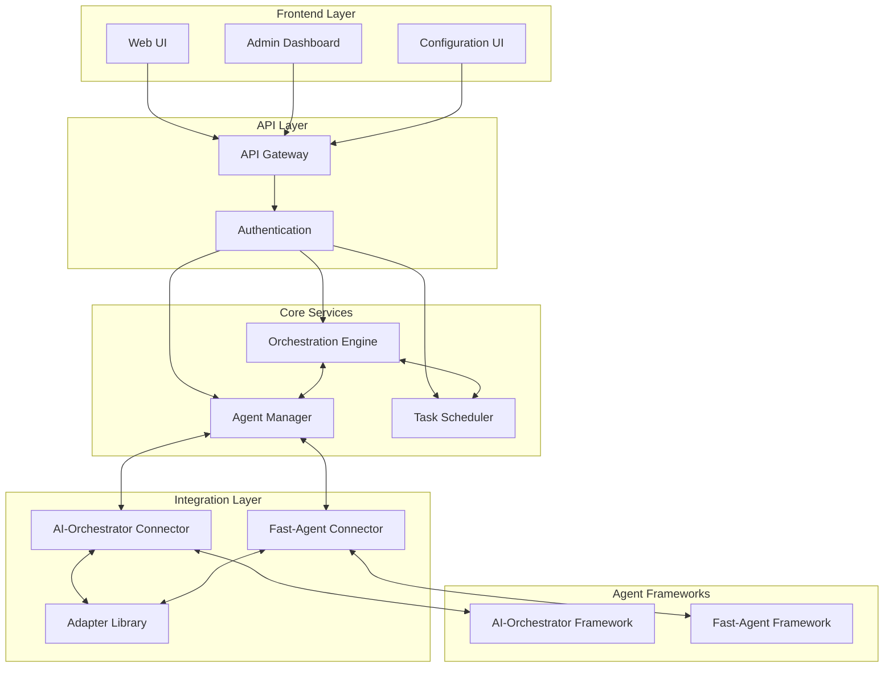
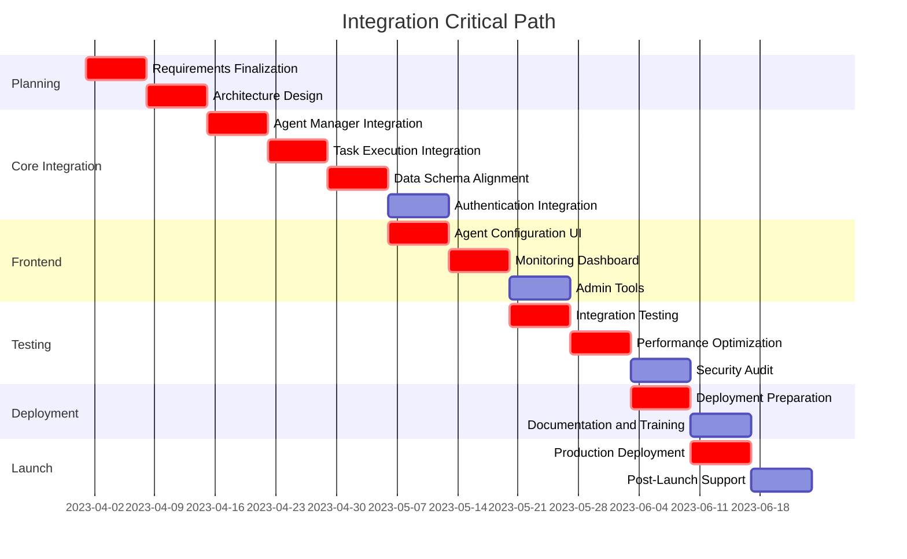

# AI-Orchestrator and Fast-Agent Integration Plan

## 1. Project Overview and Objectives

### Background

The AI-Orchestration-Platform currently consists of two separate but complementary systems:

1. **AI-Orchestrator**: A full-stack AI orchestration system with a web UI, backend API, and specialized AI agents. It provides a comprehensive infrastructure for managing AI workflows and tasks.

2. **Fast-Agent**: A Python framework for creating AI agents with a declarative syntax and support for various workflows. It offers a mature agent framework with robust capabilities for agent definition and execution.

### Integration Objectives

The primary goal of this integration is to leverage Fast-Agent's mature agent framework within AI-Orchestrator's web UI and infrastructure. Specific objectives include:

1. **Unified Agent Management**: Create a seamless system for managing both AI-Orchestrator and Fast-Agent agents through a single interface.

2. **Enhanced Workflow Capabilities**: Combine AI-Orchestrator's workflow orchestration with Fast-Agent's declarative agent syntax to create more powerful and flexible workflows.

3. **Standardized Communication**: Establish standardized communication protocols between the two systems to ensure reliable data exchange and task execution.

4. **Consistent User Experience**: Provide a consistent user experience for configuring, monitoring, and managing agents regardless of their underlying implementation.

5. **Scalable Architecture**: Ensure the integrated system maintains scalability and performance as the number of agents and workflows increases.

### Success Metrics

1. **Integration Completeness**: 100% of planned integration points implemented and tested.
2. **System Performance**: Maintain or improve performance metrics compared to standalone systems.
3. **User Adoption**: Increase in user engagement with the integrated platform.
4. **Development Efficiency**: Reduction in time required to develop and deploy new AI agents.
5. **Error Reduction**: Decrease in workflow failures and error rates.

## 2. Component Integration Strategy

### Architecture Overview

The integration will follow a modular approach, with well-defined interfaces between components. The high-level architecture will include:

### Integration Approaches

#### 1. Adapter Pattern

We will implement an adapter pattern to standardize the interface between the Agent Manager and the different agent frameworks. This will allow the Agent Manager to interact with both AI-Orchestrator and Fast-Agent agents using a consistent interface.

#### 2. Service Abstraction

The integration will abstract the underlying agent frameworks behind service interfaces, allowing the Orchestration Engine to work with agents without needing to know their implementation details.

#### 3. Data Transformation

A data transformation layer will handle the conversion between the data formats used by AI-Orchestrator and Fast-Agent, ensuring seamless data exchange between the systems.

### Key Integration Points

1. **Agent Registration and Discovery**
   - Extend the Agent Manager to support registration and discovery of Fast-Agent agents
   - Implement adapter classes to translate between Agent Manager and Fast-Agent interfaces

2. **Task Execution**
   - Create a task execution bridge that routes tasks to the appropriate agent framework
   - Implement result handling to standardize the format of task results

3. **Configuration Management**
   - Extend the configuration system to support Fast-Agent specific parameters
   - Create UI components for configuring Fast-Agent agents

4. **Monitoring and Logging**
   - Integrate Fast-Agent's logging and monitoring with the platform's centralized systems
   - Implement unified dashboards for monitoring agents from both frameworks

5. **Authentication and Authorization**
   - Extend the authentication system to support Fast-Agent's security requirements
   - Implement role-based access control for Fast-Agent resources

## 3. Detailed Timeline with Phases and Milestones

### Phase 1: Planning and Design (Weeks 1-2)

**Milestone 1.1: Requirements Finalization (End of Week 1)**
- [ ] Complete detailed requirements gathering
- [ ] Finalize integration points and interfaces
- [ ] Document API contracts between systems

**Milestone 1.2: Architecture Design (End of Week 2)**
- [ ] Complete detailed architecture design
- [ ] Define data schemas and transformation rules
- [ ] Create technical specifications for all integration components

### Phase 2: Core Integration (Weeks 3-6)

**Milestone 2.1: Agent Manager Integration (End of Week 3)**
- [ ] Implement Fast-Agent adapter in Agent Manager
- [ ] Develop agent registration and discovery mechanisms
- [ ] Create unit tests for adapter functionality

**Milestone 2.2: Task Execution Integration (End of Week 4)**
- [ ] Implement task routing and execution bridge
- [ ] Develop result handling and standardization
- [ ] Create integration tests for task execution

**Milestone 2.3: Data Schema Alignment (End of Week 5)**
- [ ] Implement data transformation layer
- [ ] Develop schema validation mechanisms
- [ ] Create tests for data transformation

**Milestone 2.4: Authentication Integration (End of Week 6)**
- [ ] Extend authentication system for Fast-Agent
- [ ] Implement secure token exchange
- [ ] Create security tests for authentication

### Phase 3: Frontend Integration (Weeks 7-9)

**Milestone 3.1: Agent Configuration UI (End of Week 7)**
- [ ] Develop UI components for Fast-Agent configuration
- [ ] Implement configuration validation
- [ ] Create user acceptance tests for configuration UI

**Milestone 3.2: Monitoring Dashboard (End of Week 8)**
- [ ] Implement unified monitoring dashboard
- [ ] Develop real-time status updates
- [ ] Create visualization components for agent metrics

**Milestone 3.3: Admin Tools (End of Week 9)**
- [ ] Develop administrative tools for managing Fast-Agent resources
- [ ] Implement batch operations for agents
- [ ] Create user acceptance tests for admin tools

### Phase 4: Testing and Optimization (Weeks 10-12)

**Milestone 4.1: Integration Testing (End of Week 10)**
- [ ] Complete end-to-end integration testing
- [ ] Resolve integration issues and bugs
- [ ] Document test results and coverage

**Milestone 4.2: Performance Optimization (End of Week 11)**
- [ ] Conduct performance testing
- [ ] Implement optimizations for identified bottlenecks
- [ ] Document performance benchmarks

**Milestone 4.3: Security Audit (End of Week 12)**
- [ ] Complete security audit of integrated system
- [ ] Address security findings
- [ ] Document security measures and compliance

### Phase 5: Deployment and Documentation (Weeks 13-14)

**Milestone 5.1: Deployment Preparation (End of Week 13)**
- [ ] Create deployment scripts and procedures
- [ ] Prepare rollback plans
- [ ] Conduct deployment rehearsals

**Milestone 5.2: Documentation and Training (End of Week 14)**
- [ ] Complete user and developer documentation
- [ ] Prepare training materials
- [ ] Conduct training sessions for users and developers

### Phase 6: Launch and Stabilization (Weeks 15-16)

**Milestone 6.1: Production Deployment (End of Week 15)**
- [ ] Deploy integrated system to production
- [ ] Monitor system performance and stability
- [ ] Address any deployment issues

**Milestone 6.2: Post-Launch Support (End of Week 16)**
- [ ] Provide post-launch support
- [ ] Collect user feedback
- [ ] Plan for future enhancements

## 4. Task Dependencies and Critical Path

### Critical Path Analysis

The following tasks form the critical path for the project:

### Key Dependencies

1. **Agent Manager Integration → Task Execution Integration**
   - Task execution depends on proper agent registration and discovery

2. **Task Execution Integration → Data Schema Alignment**
   - Data schema alignment is required for proper task execution and result handling

3. **Data Schema Alignment → Agent Configuration UI**
   - Configuration UI depends on standardized data schemas

4. **Agent Configuration UI → Monitoring Dashboard**
   - Monitoring dashboard needs to understand agent configuration

5. **Monitoring Dashboard → Integration Testing**
   - Full integration testing requires all components to be implemented

6. **Integration Testing → Performance Optimization**
   - Performance optimization should be done after integration issues are resolved

7. **Performance Optimization → Deployment Preparation**
   - Deployment preparation should include optimized components

8. **Deployment Preparation → Production Deployment**
   - Production deployment depends on thorough preparation and testing

### Parallel Work Streams

To optimize the timeline, the following tasks can be worked on in parallel:

1. **Authentication Integration** can be developed in parallel with **Data Schema Alignment**
2. **Admin Tools** can be developed in parallel with **Monitoring Dashboard**
3. **Security Audit** can be conducted in parallel with **Performance Optimization**
4. **Documentation and Training** can be prepared in parallel with **Deployment Preparation**

## 5. Risk Management Approach

### Risk Identification

| Risk ID | Risk Description | Probability | Impact | Risk Score |
|---------|-----------------|------------|--------|------------|
| R1 | API incompatibilities between systems | Medium | High | High |
| R2 | Performance degradation after integration | Medium | High | High |
| R3 | Security vulnerabilities in integration points | Low | High | Medium |
| R4 | Data loss or corruption during transformation | Low | High | Medium |
| R5 | Scope creep extending timeline | Medium | Medium | Medium |
| R6 | Resource constraints affecting delivery | Medium | Medium | Medium |
| R7 | User resistance to integrated system | Low | Medium | Low |
| R8 | Technical debt from rushed implementation | Medium | Medium | Medium |
| R9 | Deployment failures | Low | High | Medium |
| R10 | Documentation gaps | Medium | Low | Low |

### Risk Mitigation Strategies

#### R1: API Incompatibilities
- **Mitigation**: Implement comprehensive adapter layer with thorough testing
- **Contingency**: Develop fallback mechanisms for critical functionality
- **Owner**: Lead Integration Engineer

#### R2: Performance Degradation
- **Mitigation**: Establish performance baselines and conduct regular testing
- **Contingency**: Implement caching and optimization strategies
- **Owner**: Performance Engineer

#### R3: Security Vulnerabilities
- **Mitigation**: Conduct security reviews at each integration milestone
- **Contingency**: Implement additional security controls as needed
- **Owner**: Security Engineer

#### R4: Data Loss or Corruption
- **Mitigation**: Implement validation checks and data integrity measures
- **Contingency**: Develop data recovery procedures
- **Owner**: Data Engineer

#### R5: Scope Creep
- **Mitigation**: Establish clear requirements and change control process
- **Contingency**: Prioritize features and defer non-critical items
- **Owner**: Project Manager

#### R6: Resource Constraints
- **Mitigation**: Secure commitments for resources in advance
- **Contingency**: Identify backup resources and cross-train team members
- **Owner**: Project Manager

#### R7: User Resistance
- **Mitigation**: Involve users in design and testing phases
- **Contingency**: Provide comprehensive training and support
- **Owner**: UX Designer

#### R8: Technical Debt
- **Mitigation**: Establish coding standards and review processes
- **Contingency**: Schedule refactoring sprints post-integration
- **Owner**: Technical Lead

#### R9: Deployment Failures
- **Mitigation**: Create detailed deployment plans and rehearsals
- **Contingency**: Develop rollback procedures
- **Owner**: DevOps Engineer

#### R10: Documentation Gaps
- **Mitigation**: Include documentation as deliverable for each component
- **Contingency**: Allocate dedicated resources for documentation
- **Owner**: Technical Writer

### Risk Monitoring and Control

1. **Weekly Risk Reviews**: Conduct weekly risk review meetings to assess current risks and identify new ones.

2. **Risk Tracking**: Maintain a risk register that is updated throughout the project.

3. **Escalation Process**: Establish clear escalation paths for risks that exceed thresholds.

4. **Metrics and Indicators**: Define key risk indicators to provide early warning of potential issues.

5. **Contingency Reserves**: Allocate time and budget reserves for addressing unforeseen risks.

## 6. Success Criteria

### Technical Success Criteria

1. **Complete Integration**: All planned integration points are implemented and functional.
   - Metric: 100% of integration points implemented and passing tests

2. **Performance**: The integrated system maintains or improves performance compared to standalone systems.
   - Metric: Response times within 10% of baseline measurements
   - Metric: Resource utilization within acceptable thresholds

3. **Reliability**: The integrated system demonstrates high reliability in production.
   - Metric: 99.9% uptime for critical components
   - Metric: Error rates below 0.1% for agent operations

4. **Security**: The integrated system meets all security requirements.
   - Metric: All security audit findings addressed
   - Metric: Compliance with organizational security standards

5. **Scalability**: The integrated system can scale to handle increased load.
   - Metric: Support for at least 2x the current number of agents
   - Metric: Linear scaling of resource usage with load

### Business Success Criteria

1. **Improved Efficiency**: The integrated system improves operational efficiency.
   - Metric: 20% reduction in time to develop and deploy new agents
   - Metric: 15% reduction in workflow development time

2. **Enhanced Capabilities**: The integrated system provides new capabilities not available in standalone systems.
   - Metric: At least 5 new workflow types enabled by integration
   - Metric: Support for at least 3 new agent types

3. **User Adoption**: Users adopt and actively use the integrated system.
   - Metric: 80% of existing users transition to integrated system
   - Metric: User satisfaction rating of at least 4 out of 5

4. **Cost Effectiveness**: The integrated system reduces operational costs.
   - Metric: 15% reduction in infrastructure costs
   - Metric: 10% reduction in maintenance effort

5. **Innovation Enablement**: The integrated system enables new use cases and innovations.
   - Metric: At least 3 new use cases implemented within 3 months of launch
   - Metric: Positive feedback from innovation teams

### Acceptance Criteria

1. **Functional Requirements**: All functional requirements are met.
   - All agent types can be registered, configured, and executed
   - All workflow types can be created and managed
   - All administrative functions are operational

2. **Non-Functional Requirements**: All non-functional requirements are met.
   - Performance requirements are satisfied
   - Security requirements are satisfied
   - Usability requirements are satisfied

3. **Documentation**: Complete and accurate documentation is provided.
   - User documentation covers all features
   - Developer documentation covers all APIs and integration points
   - Operational documentation covers deployment and maintenance

4. **Training**: Training materials and sessions are provided.
   - Training materials cover all aspects of the integrated system
   - Training sessions are conducted for all user groups

5. **Support**: Support processes and resources are in place.
   - Support team is trained on the integrated system
   - Support documentation is complete and accurate
   - Support tools are configured and operational

## 7. Conclusion

This integration plan provides a comprehensive roadmap for combining the AI-Orchestrator and Fast-Agent systems into a unified platform. By following this plan, we will create a powerful, flexible, and user-friendly system that leverages the strengths of both frameworks.

The integration will be approached in a phased manner, with clear milestones and deliverables at each stage. Risks have been identified and mitigation strategies put in place to address them. Success criteria have been defined to ensure that the integration meets both technical and business objectives.

With careful execution of this plan, the integrated AI-Orchestration-Platform will provide significant value to users and stakeholders, enabling new capabilities and use cases while maintaining the reliability and performance they expect.
